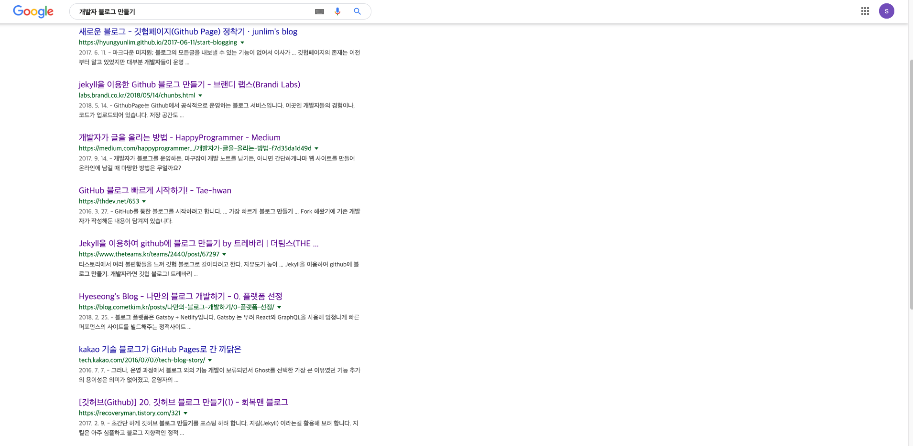
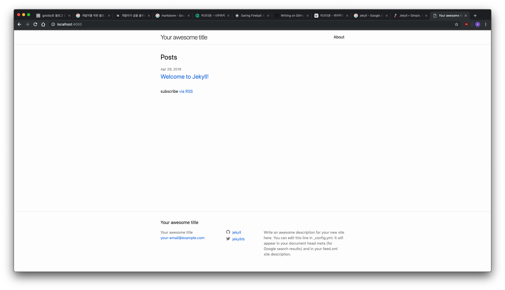

##gatsby로 만든 블로그##


+ 블로그를 만들자

개발자로 진로를 변경하고 나서 여러가지 할 것들과 배워야 할 것들이 있었지만 blog만들기 만큼 많은 실패가 있었던적이 없었다.

블로그 플랫폼이나 툴은 여러가지가 있겠지만 medium이나 tistory, jekyll, 워드프레스, Django 등등 여러가지가 있을것 같다.

블로그를 제공하는 플랫폼 네이버나, tistory 등등을 사용하면 간단하게 만들 수 있겠지만 명색이 개발자를 목표로 하고 있으니

[MarkDown(md)](https://daringfireball.net/projects/markdown/)을 이용한 정적 블로그를 만들어 보기로 했다.

검색해보니 간단하게 10분이면 만들 수 있다고 많은 블로거들이 말해주고 있었다. 

하지만 나는 기초지식이 많이 부족하기도 했고, git, github을 사용하는 법도 익숙하지 않아 내가 할 수 있을까 했지만

역시나 지금 사용하고 있는 이 블로그를 만들기 까지 정확히 세어보지는 않았지만 20번 정도 오류 페이지를 마주하고 나서야 blog를 업로드 할 수 있었다. 

+ 처음 고려한것은 Jekyll

 구글에 개발자 블로그 만들기를 검색해 보면 대부분이 Jekyll과 github을 이용해서 블로그를 시작하자고 되어있다.
(뭐 github에 올리기만 하면 블로그가 된다고?!?!)

그래서 나도 Jekyll으로 블로그 만들기를 해보았다.



``` zsh
gem install bundler jekyll
jekyll new my-awesome-site
cd my-awesome-site
bundle exec jekyll serve
브라우저로 http://localhost:4000 에 접속
```

여기까지는 성공!! 

하지만 github에 저장소(repasitory) upatisariputa.github.io를 만들어서 jekyll블로그를 적당히 수정해서 push하고 

upatisariputa.github.io에 접속해 보면 자꾸 내가 원하는 jekyl블로그가 나오지 않는 것이였다.

역시나 부족한 git사용법이 발목을 잡은 것일까...

테마를 입혀서 업로드도 해보고 아예 테마를 fork해서 배포도 해보았지만 전부 실패

git 사용법이 익숙하지 않아 git사용을 편하게 해주는 [sourcetree](https://www.sourcetreeapp.com/)도 사용해 보았지만 실패...

결국 무수한 실패에 **검색 검색 검색 검색** 노가다를 했다. 

그러다가 정적 블로그를 만드는데 jekyll만 있는게 아닌것을 알았다.

+ 다음은 gatsby

처음엔 [netlify](https://www.netlify.com/)를 먼저 발견했다. 나는 netlify가 jekyll같은 정적 블로그를 만들어주는 툴인줄 알았다.

하지만 더 검색을 해본결과 netlify는 github에 있는 repository를 배포를 해주는 도구였다.

[netlify란? https://heropy.blog/2018/01/10/netlify/](https://heropy.blog/2018/01/10/netlify/)이분의 블로그에 자세히 설명이 되어있다.

어쩌겠는가 netlify는 블로그를 만드는 툴이 아닌 것을 

그러다 알게 된것이 hexo, gatsby였다.

Jekyll, hexo, gatsby를 간단히 비교 하자면

+ **Jekyll**: ruby를 사용
+ **hexo**: node.js를 사용
+ **gatsby**: react를 사용

내가 배우려는 react와 node.js로 만든 정적블로그 생성기가 있다고?!

Jekyll은 실패했으니 제외하고 hexo와 gatsby를 알아보았다. 

hexo는 중국인이 만든 generater인데 업뎃이 조금 느리다는 소문을 들었다.

그리고 내가 곧 배울 내용이 코드스테이츠 IMMERSIVE 과정이 react로 시작해서 (node.js를 더 배우고 싶지만)

gatsby로 만들어 보기로 했다.

하지만 gatsby로 만드는 과정도 순탄치만은 않았는데....


