##gatsby로 블로그를 만들자##

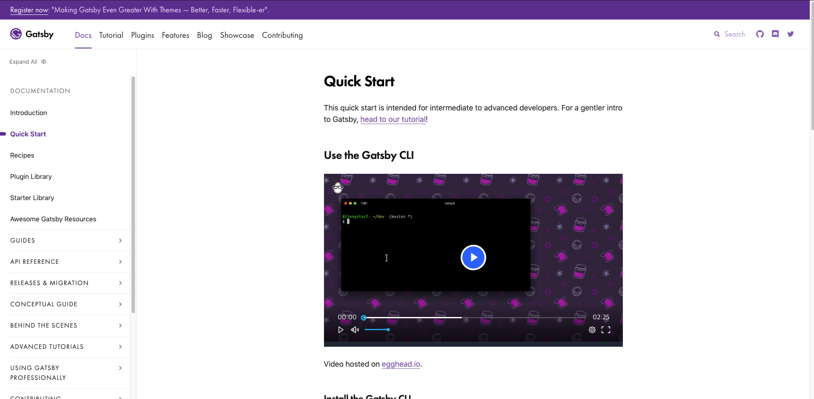
무수한 영어의 압박이(그럴땐 구글 번역을 사용하자)

[gatsby튜토리얼](https://www.gatsbyjs.org/tutorial/)
Jekyll은 친절하게 한국어로 설명을 해주는데 gatsby는 한국어 번역이 안 되어있다.(그럴땐 구글 번역을 사용하자)

우선 gatsby 사용설명서에 따르면 

0. 환경 준비하기

    node.js, npm cli, gatsby cli가 준비되어야 한다.

    node.js. npm cli, gatsby cli 사용법 및 설치법은 
    [gatsby 개발환경 설정 0 참고](https://www.gatsbyjs.org/tutorial/part-zero/)

1. gatsby stater를 사용 vs 직접 만들기

    본인은 아직 JAVASCRIPT걸음마 단계라 react는 사용 할 줄 모른다....
    
    그러므로 [gatsby starter](https://www.gatsbyjs.org/starters/?v=2)를 사용하기로 했다.
    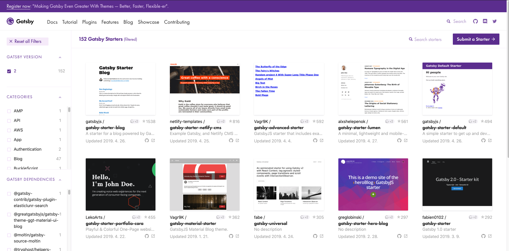

    여러개의 gatsby 스타터들이 있다.

3. gatsby stater 고르기

    처음엔 gastby-stater-lumen을 사용했었다. 
    그러다 그냥 뭔가 조금 부족해 보여서 gatsby-starter-personal-blog를 사용했다.(멋있잖아)

4. 골랐다면 시작해보자

    gatbsy cli gatsby new 명령을 사용해서 gatsby-stater-personal-blog를 설치해보자

    ``` zsh
    gatsby new [NEW_SITE_DIRECTORY_FOR_YOUR_BLOG] https://github.com/greglobinski/gatsby-starter-personal-blog.git
    ```
    [NEW_SITE_DIRECTORY_FOR_YOUR_BLOG]에는 자신이 설치하고 싶은 directory를 설정해 주면 된다.

    나의 경우는 gatsbyblog를 사용했다. 맥이라면 아래와 같이 입력하자

    ``` zsh
    gatsby new gatsbyblog https://github.com/greglobinski/gatsby-starter-personal-blog.git
    ```

    그러면 알아서 gatsbyblog에 설치가 된다.(얼마나 편한 세상인가)

    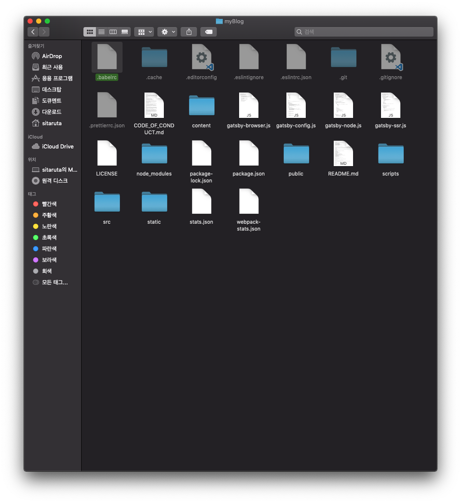 설치된 모습

    그 다음 커맨드를 입력한다.

    ``` zsh
    cd gatsbyblog
    myblog $ gatsby develop
    ```
    
    위와 같이 입력했다면 

    브라우져 주소 창에 localhost:8000을 입력하자

    아래와 같이 뜬다면 성공!!

    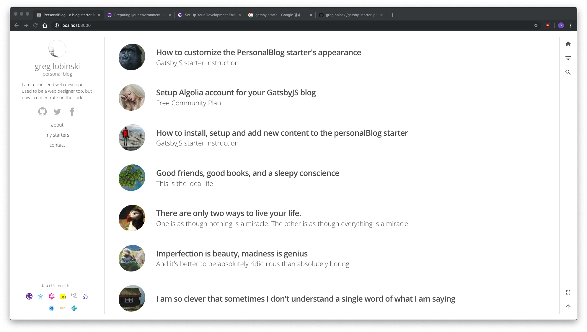 

5. 이제 이 블로그는 제것입니다. 

     

    블로그를 설치하면 대머리 아저씨가 흐뭇하게 보고 있다.(동질감이 느껴진다.)

    아마 이 stater blog를 만드신 분 같다.

    여기저기 보면 about, contact, footer등 설정 초기 상태로 되어있으므로 내것으로 만들어야 한다.

    [gatsby-stater-personal-blog](https://github.com/greglobinski/gatsby-starter-personal-blog)여기에 가보면 **Instructions & tutorials**에 이 블로그를 자신의 것으로 만드는데 설명이 되어있다.

    우선 대머리 아저씨 사진부터 바꾸고 싶다.

    gatsbyblog/src/images/jpg 디렉토리에 가면 

    avatar.jpg가 있을것이다. 그 사진을 지우고 자신이 올리고 싶은 사진을 avatar.jpg로 변환 하면 대머리 아저씨는 사라질 것이다.

    사진을 바꿨다면 gatsbyblog/content/meta/config.js파일을 열어보자

    [config](config.png)

    siteTitle, siteUrl 등을 자신의 것으로 바꾸어준다.

    gatsbyblog/content/pages/ 디렉토리에는 infobox의 내용을 변경 할 수 있으므로 my staters가 필요 없다면 mystaters폴더를 삭제 해준다. 혹시 추가를 하고 싶다면 

    숫자--이름(3--myblog) 처럼 폴더를 입력하고 추가하면 된다.

    gatsbyblog/content/pages/1--about/index.md에는 자신 프로필이나 간단한 자신에 대한 설명을 쓰면 될것 같다.

    gatsbyblog/content/parts/ 디렉토리에는 author, footer, info 등을 변경 할 수 있다.

6. post를 써보자

    이 부분에서 가장 오류가 많이 났었는데 오류를 읽을지 모르는 현상에서 벌어진 일이었다. 오류를 잘 읽어보면 금방 해결 할 수 있었는데...

    gatsbyblog/content/posts/ 디렉토리에 가면 greg lobinski님 께서 작성하신 post가 여러개 있다.

    post는 posts 폴더안에 날짜--제목(2019-04-30--title)이런 형식으로 폴더를 만든 다음 index.md를 만들어서 글을 올려야 한다.

    여기서 posts의 내용을 전부 삭제하고 자신이 써보도록 하자.

    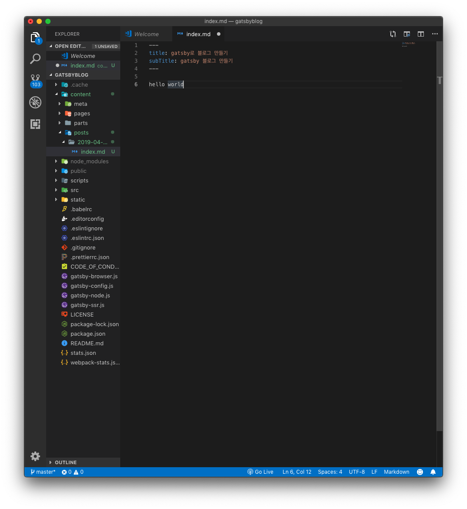 위와 같이 쓰고 새로고침을 하면 정상적으로 출력이 되지만 서버를 종료(터미널에서 ctrl+c) 하고 다시 서버를 실행하면 아래와 같이 에러메세지가 뜨게 된다.

    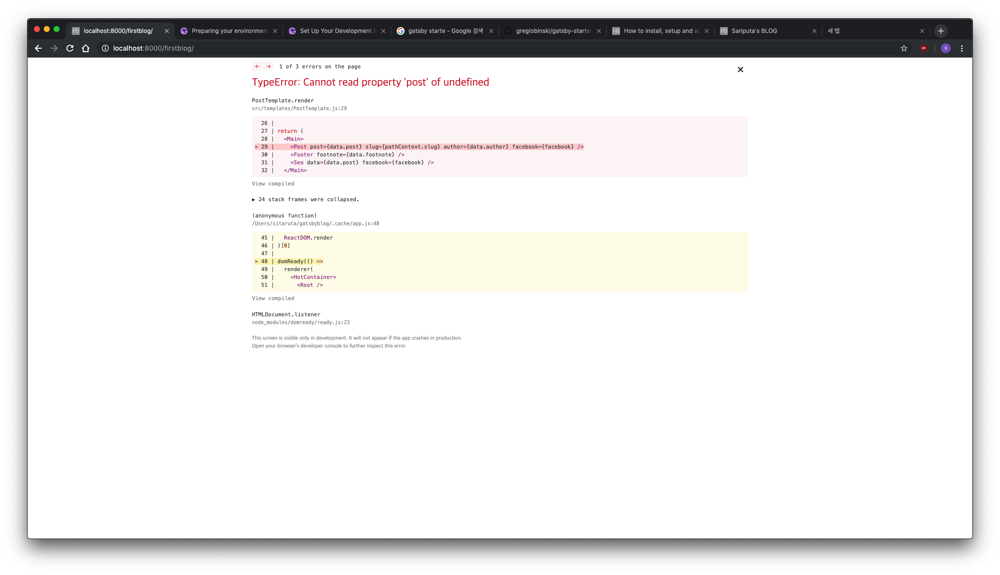 브라우저
    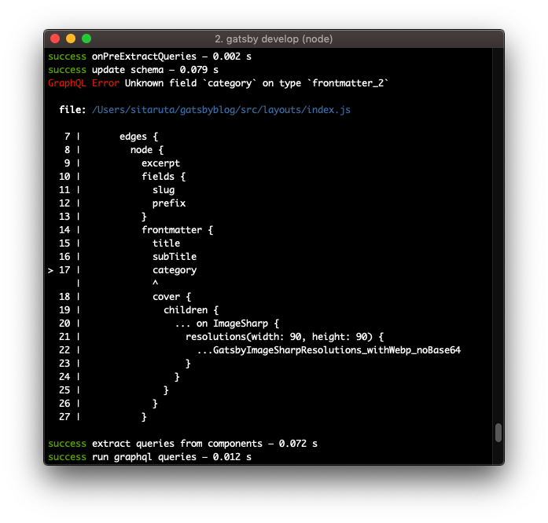 터미널

    나중에야 알았지만 markdown 형식을 제대로 안 맞춰서 생긴 오류였다...

    ``` md
    ---
    title: title
    subTitle: subtitle
    menuTitle: menutitle
    date: "2019-00-00 00:00:00"
    category: "category"
    cover: cover.png
    ---
    ```

    되도록 위의 형식을 맞추도록 하자 (gatsby를 잘 아시는 분은 직접 수정하시면 될것 같다.)

    gatsby-starter-personal-blog에는 algolia라는 검색도구를 사용 할 수 있다.

    algolia 적용법은 [Setup Algolia account for your GatsbyJS blog](https://dev.greglobinski.com/setup-algolia-account/)를 참고하도록 하자

7. post까지 했으면 배포를

    우선 gatsby github 저장소(repository)에 push를 한다. 

    netlify에서 내가 github으로 push한 저장소(repository)를 배포하면 되는데

    우선 netlify로 배포하는 법을 자세히 설명해주신 블로그가 있으니 참고하도록 하자

    [netlify로 배포하기](https://blog.outsider.ne.kr/1417)

    netlify에서 github으로 sign in을 한 다음 New site from Git을 누른다.

    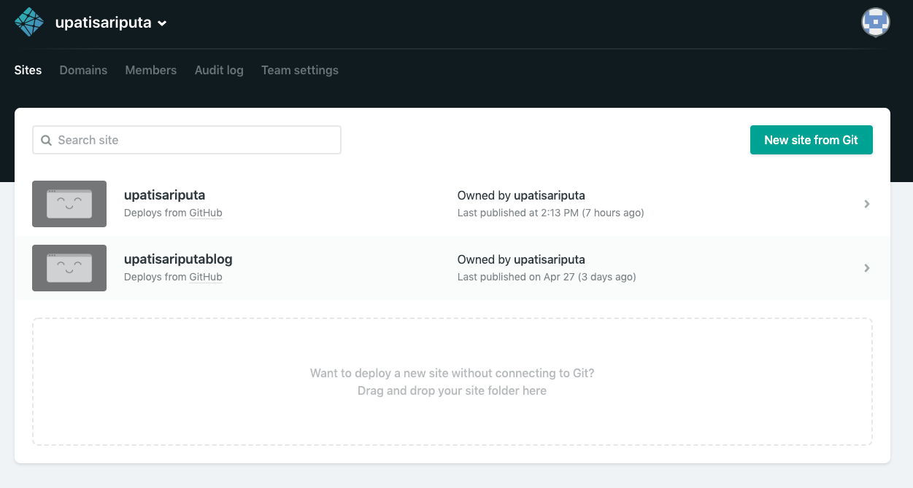

    git 제공자를 Github으로 선택

    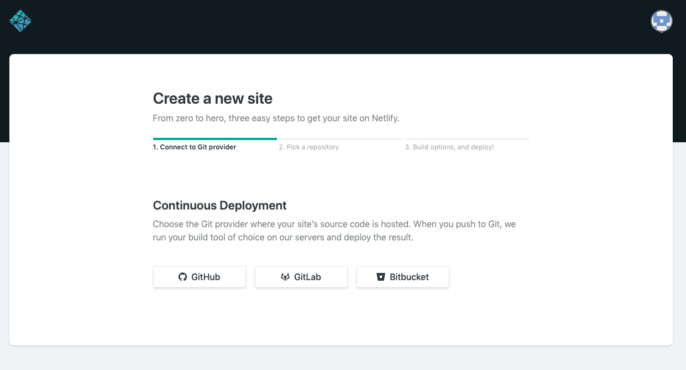

    저장소(repository)를 선택

    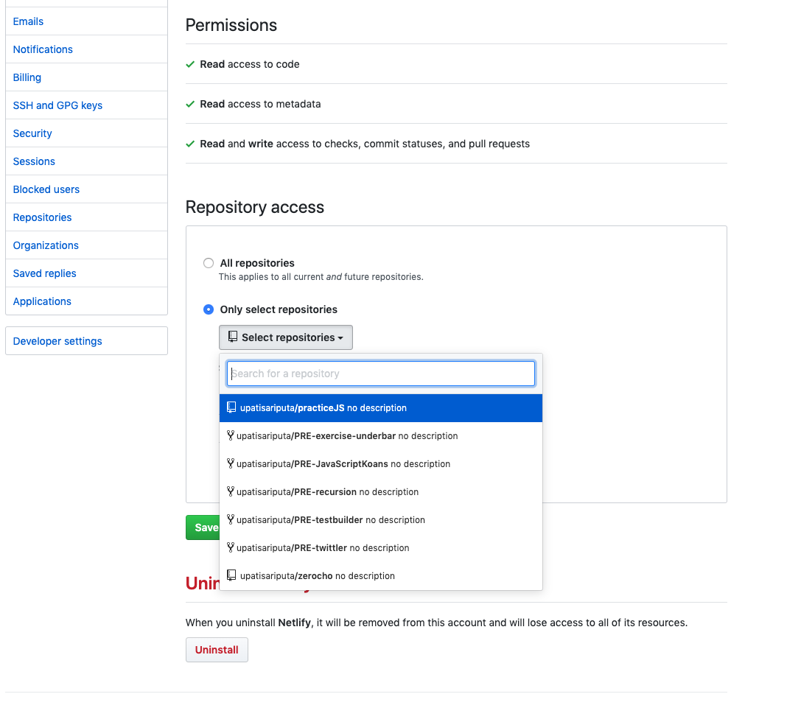

    선택하면 자동으로 netlify가 github의 저장소에서 배포 준비를 한다. 

    혹시 배포가 되지 않고 실패를 한다면 Deploy log를 확인하자

    어디서 무엇이 오류를 발생하는지 알 수 있다. 

    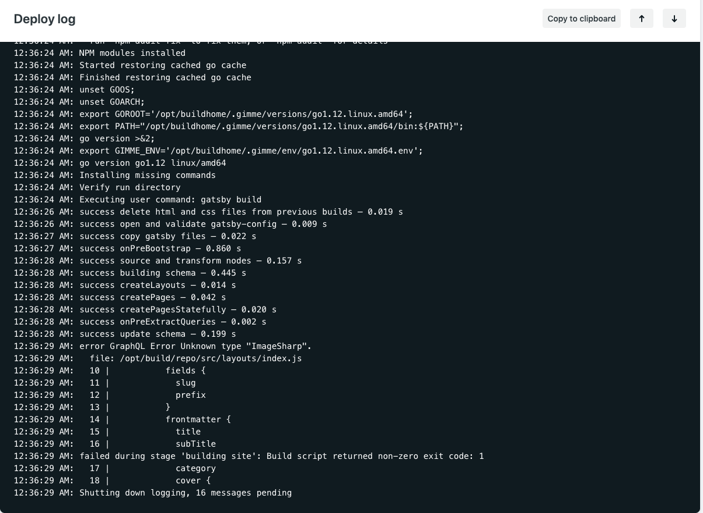

    아래와 같이 PUBLISHED가 뜨면 성공한 것이다. 

    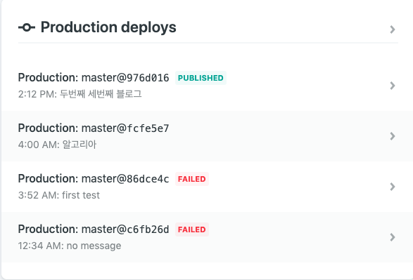

    마지막으로 사이트의 도메인을 변경해주면 완료이다. 

    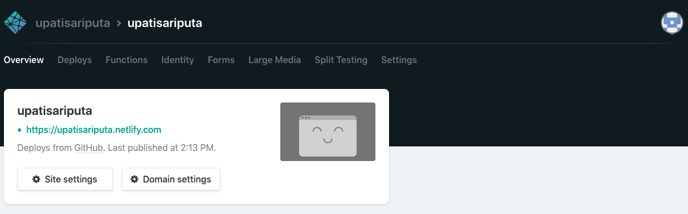

    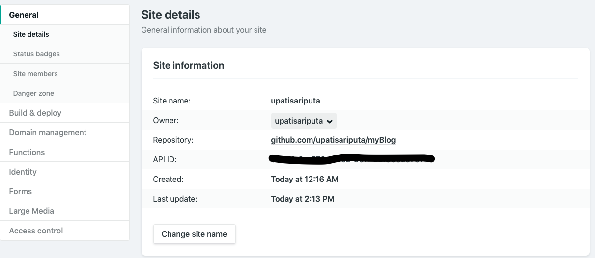

    여기서 Site name을 자신이 원하는 이름으로 변경해준다. 

    그리고 나서 [site name].netlify.com으로 접속해서 블로그가 정상적으로 뜬다면 성공이다!!

    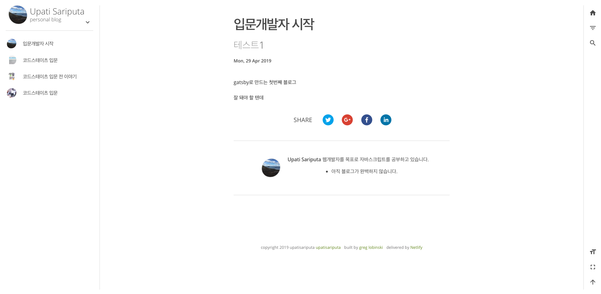

위와 같이 했는데도 실패 할 수도 있을 것이다. 

오류메세지를 잘 읽어보고 배포를 하면 대부분 성공 할 것이다. 