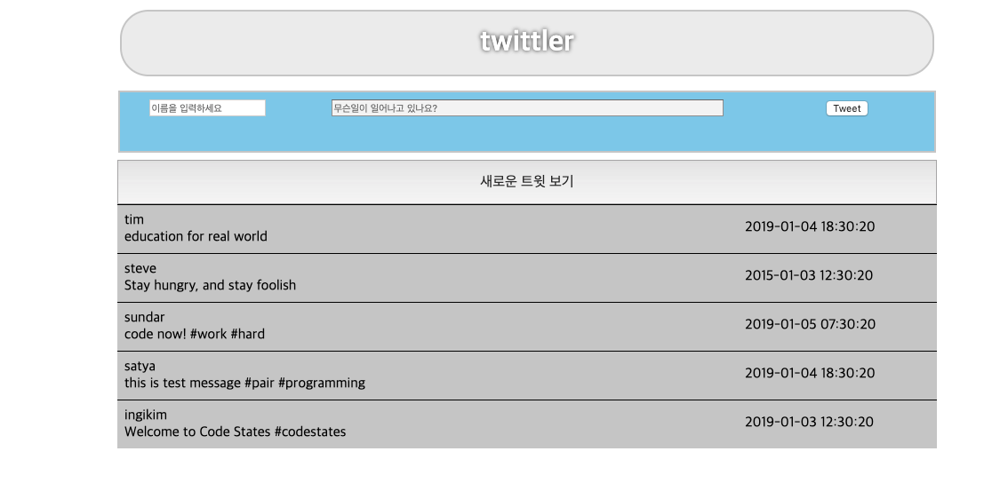

##Twitter clone Twittler 만들기##

+ 코드스테이츠 Twttler 과제 개략

    HTML, CSS, JAVASCRIPT를 사용하여 twitter의 기능들을 간단히 구현해보았다.

    

    위의 사진은 코드스테이츠 과제인 twittler를 구현한것이다.

    우선 Twttler를 구현하기 위해서는 HTML, CSS, JAVASCRIPT의 기본적인 내용을 알고 있어야 하고

    [DOM](https://developer.mozilla.org/ko/docs/Gecko_DOM_Reference/%EC%86%8C%EA%B0%9C)에 대한 지식이 있어야 한다. 

    **DOM**에 대한 설명은 위의 MDN에 잘 나와 있지만 간략히 하자면 **프로그래밍 언어가 웹페이지에 접근하여 웹페이지를 조작 할 수 있께 하는 객체 모델이다.**

    과제에서 주어지는 것은 DATA.js인데 DATA에는 DATA객체, randomUser, randomMessage배열, generateNewTweet 함수가 저장되어 있다.

    이 DATA.js에 저장되어 있는 내용을 script.js에서 프로그래밍하여 index.html의 구조에 접근하게 하여 출력하게 하는 것이다.

    해야할 것 들은 

    1. index.html에 HTML구조 만들기 (입력form, 랜덤출력 버튼, DATA 출력 부분이 있어야 한다.)
    2. index.html에서 script.js로 구조 가져오기
    3. DATA.js의 DATA내용 index.html로 내보내기
    4. 입력form에 입력한 내용을 DATA출력 부분으로 보내기 
    5. DATA.js의 random 내용을 새로운 트윗보기 버튼 클릭시 랜덤하게 index.html의 DATA내용 위에 출력하기
    6. 출력된 DATA에서 이름 클릭시 이름으로 타임라인을 볼수있게 하기
    7. CSS로 화면 스타일 변경하기
    


+ 어려웠던 부분

    ```javascript
    // 입력 내용 출력
    document.querySelector('#tweetButton').addEventListener('click', function(){
    divMake[contextsCount] = document.createElement('div')
    divMake[contextsCount].innerHTML = '<span class = "ID" onclick="clickEvent()">' 
    + usernameInput.value + '</span>'+ '<span id = "date">' + "DATE : " 
    + newTweet.created_at+ '</span>' + '<br>' + "Context : " + messegeInput.value;
    contextSelect.appendChild(divMake[contextsCount]);
    contextsCount += 1;
    });

    // 랜덤 출력
    var newTweet = generateNewTweet();
    document.querySelector('#newContext').addEventListener('click',function(){
    newTweet = generateNewTweet()
    divMake[contextsCount] = document.createElement('div')
    divMake[contextsCount].innerHTML = '<span class = "ID" onclick="clickEvent()">' 
    + newTweet.user + '</span>'+ '<span id = "date">' + "DATE : " 
    + newTweet.created_at+ '</span>' + '<br>' + "Context : " + newTweet.message;
    generateNewTweet();
    contextSelect.appendChild(divMake[contextsCount]);
    contextsCount += 1;
    });

    // DATA 내용 출력
    for(var i = 0; i < 5; i++){
        divMake[i] = document.createElement('div')
        divMake[i].innerHTML = 
        '<span class = "ID" onclick="clickEvent()">'+ DATA[i]['user'] + '</span>'
        + '<span id = "date">' + "DATE : " 
        + DATA[i]['created_at'] + '</span>' + '<br>' 
        + "Context : " + DATA[i]['message'];
        contextSelect.appendChild(divMake[i])
        contextsCount += 1;
    };
    ```

+ 위의 코드처럼 DATA의 내용을 화면에 바로 출력하려하니 문제가 발생하였다.

    1. 랜덤 버튼 클릭이나 새로운 글 입력 시 DATA의 윗부분으로 가야할 내용이 가장 아래에 출력되는 문제

        + 새로운 글 출력 시 DATA의 윗부분으로 가기 위해 DATA 내용 출력 부분을 다시 작성했다.


    2. 타임라인 구현의 어려움
