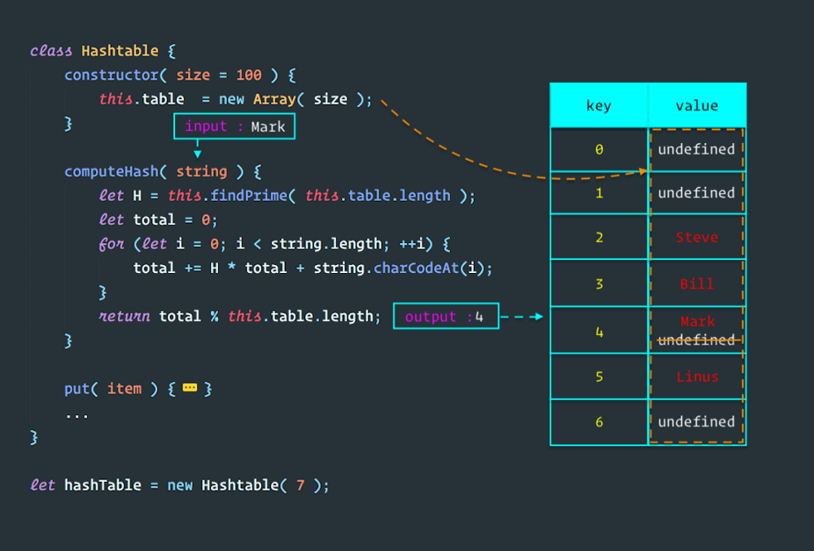

# 자료구조 Part2

## Hash Table(Hash map)

### Hash Talbe이란?

- 입력받은 데이터를 해시(해시 함수를 사용)하여 테이블 내의 주소를 계산하고 이 주소에 데이터를 담는것
- 키를 이용하여 값을 저장
- 검색 성능은 해시 함수의 성능과 해시 테이블의 크기에 좌우

- 해시테이블을 간단하게 객체로 구현

```javascript
menu = {
  "french fries": 0.75,
  hamberger: 2.5,
  "hot dog": 1.5,
  soda: 0.6
};
menu["french fries"]; // 0.75
```

- menu 객체의 키가 Hash Table의 키가 되고, menu 객체의 값이 Hash Table의 값이 된다고 아주 간략하게 생각하면 되겠다.
  보통은 Hash Table의 값은 Hash function에 의해 정해 진다.
  (질문 내용 Hash Table은 꼭 Hash function에 의해 값을 내야 하나요??)

### Hash Table 용어

- 해싱 : 키를 값으로 변환하는 과정
- 해시 함수 : 키를 특정 숫자로 변환하는데 사용한 코드
- 버킷 : 데이터가 저장된 장소
- 충돌 : 서로 다른 입력 값에 대해 동일한 해시 값, 즉 해시 테이블 내의 동일한 주소를 반환하는 것(정교한 알고리즘이라도 모든 입력값에 대해 고유한 해시값을 만들지 못 한다)
- 클러스터 : 일부 지역의 주소들을 집중적으로 반환 하는 결과로 데이터들이 한 곳에 모이는 문제
- 오버플로우 : 해시충돌이 버킷에 할당된 슬롯 수 보다 많이 발생하면 더이상 버킷에 값을 넣을 수 없는 현상

### Hash Table 속성

- 해싱된 키를 가지고 인덱스로 사용하기 때문에 삽입, 삭제, 검색이 매우 빠르다
- 해시 함수를 사용하는데 추가적 연산이 필요
- 적은 데이터 저장시 구현 방식에 따라 Linked List를 사용하는 경우 오버 헤드의 부담이 생기고, 캐시 효율이 떨어짐
- Hash Table의 크기가 유한적이고 해시 함수의 특성상 해시 충돌(Hash Collision)이 발생
- 충돌이 없거나 적으면 O(1)의 상수 시간에 가까워지고, 충돌이 발생하면 할수록 성능은 점점 O(N)에 가까워진다.

### Hash Table 알고리즘(해시 함수) 종류

- 나눗셈법 : 입력 값을 테이블의 크기로 나누고, 그 '나머지'를 테이블의 주소로 사용
- 자릿수 접기 : 숫자의 각 자릿수를 더해 해시 값을 만드는 것
- 이외에도 다수

### Hash Table 충돌 조정

- Hash Table은 다음 요인에 따라 효율성이 정해짐
  1. Hash Table에 얼마나 많은 데이터를 저장하는가
  2. Hash Table에서 얼마나 많은 셀을 쓸 수 있는가
  3. 어떤 해시 함수를 사용하는가

### Hahs Table 충돌 조정 방법

- Separate Chaining(Closed Addressing) 방식 : Linked List(연결 리스트) 사용하여 키에 매핑된 인덱스가 가리키는 Linked List에 Node를 추가하여 값을 추가한다.

- Open Addressing 방식 : Hash Table의 빈 버킷을 이용

- Coalesced Chaining(Coalesced hashing)방식 : Separate Chaining과 Open Addressing을 혼합 =

### Hash Table 예

- 블록체인

### Hash Table Psuedo Code

- Core
  

- Put

```javascript
put(item){
  let key = this.couputeHash(item)
  return !this.table[key] ? this.table[key] = itme : false;
}
```

- Remove

```javascript
remove(item){
  let key = this.computeHash(item){
    return this.table[key] = undefined
  }
}
```

- Search & Size

```javascript
search(item){
  let key = this.computeHash(item)
  return this.table[key] == item
}

size(){
    let counter = 0
    for(let i = 0; len = this.table.length; i<len; i++){
      if(this.table[i]){counter++}
    }
    return counter
  }
}
```

- IsEmpty

```javascript
isEmpty(){
  for(let i = 0; len = this.table.length; i < len; i++){
    if(this.table[i]) {return false}
  }
  return true
}
```

[hash table 참조](https://dev-kani.tistory.com/1)

[hash table 참조](https://medium.com/dev-blogs/ds-with-js-hash-table-4715c94083d2)
