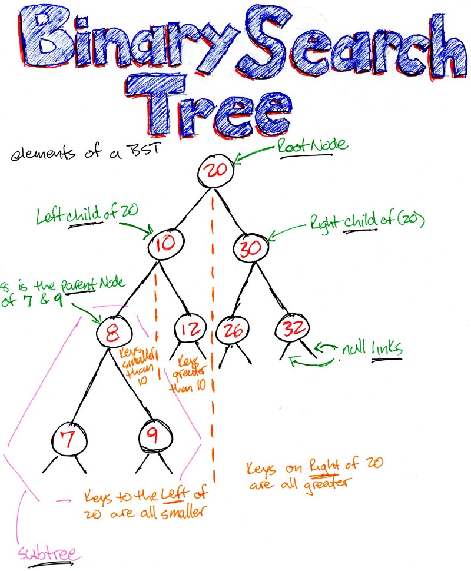

# 자료구조 Part2

## Binary Search Tree

### Binary Search Tree란?

- 이진탐색(binary search)와 연결리스트(Linked list)를 결합한 자료구조
- 이진탐색의 효율적인 탐색 능력을 유지하면서, 빈번한 자료입력과 삭제가 가능



### Binary Search Tree의 속성

- 완전이진 트리
- 각 노드의 왼쪽 서브트리에는 해당 노드의 값보다 작은 값을 지닌 노드
- 각 노드의 오른쪽 서브트리에는 해당 노드의 값보다 큰 값을 지닌 노드
- 룩업 연산(트리에 있는 특정 노드의 위치를 알아내는 연산)을 빠르게 처리 가능

### Binary Search Tree 용어

- 루트 : 가장 상위 노드(트리의 꼭대기)
- 부모 : 자식 노드에 비하여 상위 노드
- 자식 : 부모 노드에 비하여 하위 노드
- 레벨 : 루트에서 가장 마지막 자식까지 가는 단계

### Binary Search Tree 예

- 이진 암호화
- 데이터 베이스
- 파일 시스템

### Binary Search Tree Psuedo Code

- 검색

1. 노드의 값을 확인
2. 찾고 있는 값인지 확인
3. 찾고 있는 값이 현재 노드보다 작다면 왼쪽 하위 트리를 검색
4. 찾고 있는 값이 현재 노드보다 크면 오른쪽 하위 트리 검색

```javascript
function search(value, node) {
  // 기저 조건: 노드가 없거나
  // 찾고 있던 값이면
  if (node == undefined || node.value == value) {
    return node;
  }
  // 찾고 있는 값이 현재 노드 보다 작으면
  // 왼쪽 자식을 검색
  else if (value < node.value) {
    return search(value, node.leftChild);
  }
  // 찾고 있는 값이 현재 노드보다 크면
  // 오른쪽 자식을 검색
  else {
    // value > node.value
    return search(value, node.rightChlid);
  }
}
```

- 삽입

1. 루트부터 검색 시작
2. 넣어야할 값보다 큰지 작은지 확인
3. 넣을 값이 현재 노드 보다 작다면 왼쪽 하위 트리 검색
4. 넣을 값이 현재 노드 보다 크다면 오른쪽 하위 트리 검색
5. 넣을 값 아래에 자식이 없으면 값을 삽입

```javascript
function insert(value, node) {
  if (value < node.value) {
    // 왼쪽 자식이 없으면 왼쪽 자식으로서 값을 삽입
    if (node.leftChlid == undefined) {
      node.leftChild = TreeNode(value);
    } else {
      insert(value, node.leftChild);
    }
  } else if (value > node.value) {
    // 오른쪽 자식이 없으면 오른쪽 자식으로서 값을 삽입
    if (node.rightChild == undefined) {
      node.rightChild = TreeNode(value);
    } else {
      insert(value, node.rightChild);
    }
  }
}
```

- 삭제

1. 루트부터 검색 실행
2. 검색과 동일하게 실행
3. 자식이 없으면 값을 삭제
4. 자식이 하나 있으면 자식을 삭제 한 위치에 삽입
5. 자식이 둘 있으면 자식 중 삭제된 노드보다 큰 값 중 최소값을 후속자 노드로 대체
6. 후속자 노드에 오른쪽 자식이 있으면 후속자를 삭제된 자리에 넣은 후, 후속자 노드의 오른쪽 자식을 후속자 노드의 원래 부모의 왼쪽 자식으로 넣음

```javascript
function del(valueToDelete, node) {
  // 트리 밑바닥에 도달해서 부모 노드에 자식이 없으면 기저 조건이다.
  if (node == undefined) {
    return undefined;
  }
  // 삭제하려는 값이 현재 노드보다 작거나 크면
  // 현재 노드의 왼쪽 혹은 오른쪽 하위 트리에 대한 재귀 호출의 반환값을
  // 왼쪽 혹은 오른쪽 자식에 할당
  else if (valueToDelete < node.value) {
    node.leftChild = del(valueToDelete, node.leftChild);
    // 현재 노드(존재한다면 그 하위 트리)를 반환해서
    // 현재 노드의 부모의 왼쪽 혹은 오른쪽 자식의 새로운 값으로 쓰임
    return node;
  } else if (valueToDelete > node.value) {
    node.rightChild = delete (valueToDelte, node.rightChild);
    return node;
  }
  // 현재 노드가 삭제하려는 노드인 경우
  else if ((valueToDelete = node.value)) {
    // 현재 노드에 왼쪽 자식이 없으면,
    // 오른쪽 자식(존재한다면 그 하위 트리)을 반환함으로써 삭제하고,
    // 그 부모의 새 하위 트리가 될 수 있도록 함
    if (node.leftChild == undefined) {
      return node.rightChild;
      // (현재 노드에 왼쪽 또는 오른쪽 자식이 없으면, 이 함수 코드 첫 줄에 따라 undefined로 끝남)
    } else if (node.rightChild == undefined) {
      return node.leftChild;
    }
    // 현재 노드에 자식이 둘이면,
    // 현재 노드의 값을 후속자 노드의 값으로 바꾸는
    // (아래) lift 함수를 호출함으로써 삭제
    else {
      node.rightChild = lift(node.rightChild, node);
      return node;
    }
  }
}

function lift(node, nodeToDelete) {
  // 이 함수의 현재 노드에 왼쪽 자식이 있으면,
  // 왼쪽 하위 트리로 계속해서 내려가도록 함수를 재귀적으로 호출함으로써
  // 후속자 노드를 찾는다
  if (node.leftChild) {
    node.leftChild = lift(node.leftChild, nodeToDelte);
    return node;
  }
  // 현재 노드에 왼쪽 자식이 없으면,
  // 이 함수의 현재 노드가 후속자 노드라는 뜻이므로
  // 현재 노드의 값을 삭제하려는 노드의 새로운 값으로 할당
  else {
    nodeToDelete.value = node.value;
    // 후속자 노드의 오른쪽 자식이 부모의 왼쪽 자식으로 쓰일 수 있도록 반환한다.
    return node.rightChild;
  }
}
```

### 이진탐색트리 참조

- 누구나 자료 구조와 알고리즘
- [이진 탐색 트리](https://idea-sketch.tistory.com/26)
- [이진 탐색 트리](https://gmlwjd9405.github.io/2018/08/12/data-structure-tree.html)
- [자바스크립트를 통한 자료구조 학습](https://github.com/scratchstudio/dsa-js-study)

## Graph와 Tree 차이
