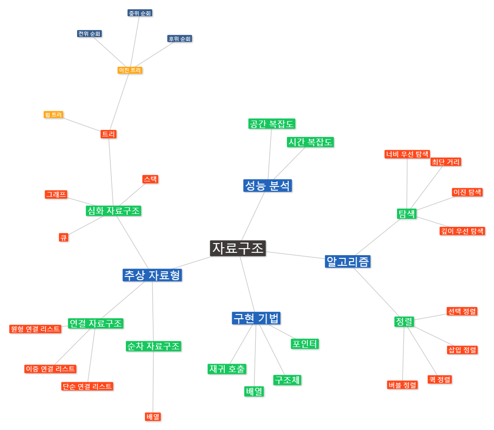

# 자료구조

## 자료구조란?

- 자료를 어떻게 효율적으로 조직, 관리, 저장할 것인지에 대한 것

### 자료와 구조란 단어를 분리해서 생각해 보면 (국어사전 정의)

- 자료 : 컴퓨터가 처리할 수 있는 문자, 숫자, 소리, 그림 따위의 형태로 된 정보 (연구나 조사 따위의 바탕이 되는 재료)
- 구조 : 부분이나 요소가 어떤 전체를 짜 이룸. 또는 그렇게 이루어진 얼개 (집합과 거기에서 정하여진 연산이나, 집합과 거기에서 정해진 관계 등 집합과 그것이 가지고 있는 집합론적 대상으로 얽어진 것)

- 위의 단어를 참고 해서 자료구조란 무엇인가를 생각해 보면

  - 컴퓨터가 처리할 수 있는 정보를 부분이나 요소가 어떤 전체를 짜 이루게 하는 것이라고 판단하면 된다.

- 참고한 블로그에서는 자료를 도서관에 무수히 많은 책이라 가정하고, 구조를 도서관에 무수히 많은 책을 **규칙에 맞게 정리하는 식별법**이라고 함
  [자료구조 참고](https://master-hun.tistory.com/60)

## Stack

### stack의 사전적 정의

(깔끔하게 정돈된) 무더기(더미), (도서관의)서가, 스택(일시적으로 보존하고 싶은 데이터를 차례로 겹쳐 쌓듯이 수납해 가는 기억 장치)

- 위의 사전적 정의에서 주의 깊게 살펴봐야 할 것은 **일시적으로 보존하고 싶은 데이터를 차례로 겹쳐 쌓듯이 수납해 가는**이다.

- stack 이란 목록 한 쪽 끝에서만 자료를 넣거나 뺄 수 있는 자료구조의 일종이라고 생각하면 되겠다. (단순히 원소들의 리스트)

- 위의 그림을 살펴보면 stack의 예시를 알 수 있다. 사진속의 링(헬로키티 링 쌓기 놀이!!)을 꺼내기 위해서는 보라색 부터 주황, 분홍, 초록, 파랑의 순서대로 차례대로 꺼내야 한다. 초록을 먼저 꺼내고 싶다고 해서 초록을 먼저 꺼내면 키티는 부서지고 말것이다.(ㅠㅠ)

### stack의 세가지 제약

- 데이터는 스택의 끝에만 삽입 가능하다. (**스택에 푸시**)
- 데이터는 스택의 끝에서만 읽을 수 있다.
- 데이터는 스택의 끝에서만 삭제할 수 있다.(**스택으로 부터 팝**)

## Queue

### queue의 사전적 정의

(무엇을 기다리는 사람자동차 등의) 줄

- **queue는 선입선출(先入先出, First In First Out; FIFO)의 자료구조**이다.

- queue 또한 임시데이터를 다루며 제약이 있는 배열이다.

- 놀이 동산에서 줄을 서 본적이 있는가? 그렇다면 먼저온 사람이 먼저타는 것이다!! 새치기를 하면 어떻게 되는가?? 당신의 상상에 맡기겠다. 돈이 많아서 프리패스권을 끊으셨다고요?? 그럼 먼저가세요~~ 하지만 queue에서는 새치기는 없다. 먼저 들어온 자료가 먼저 나가는 것이다.

### queue의 세가지 제약

- 데이터는 queue의 끝에만 삽입(stack과 동일)
- 데이터는 queue의 앞에만 읽을 수 있음(stack과 반대)
- 데이터는 queue의 앞에서만 삭제(stack과 반대)

## Linked List

### linked list란?

배열과 마찬가지로 항목의 리스트를 표현하는 자료구조, 그러나 배열과는 다르게 엘리먼트와 엘리먼트간의 연결을 이용해 리스트를 구현한 것

### 노드란?

linked list는 나란히 이어진 메모리 셀 묶음이 아님, **서로 인접하지 않은 메모리 셀 묶음으로 이뤄짐**, 컴퓨터 메모리 전체에 걸쳐 여러셀에 퍼져있을 수 있고, **서로 인접하지 않은 이러한 메모리 셀을 노드라고 부름** (linked list에서 자료와 다음 자료가 있는 위치를 같이 표현하는 개채 하나를 노드라 함)

### linked list의 예

- 만일 김노드란 초딩이 오늘 가방을 집에 놓고 와서 여러가지 준비물들을 친구한테 빌려야 한다고 가정해보자. 김노드는 노트, 교과서, 연필, 권총, 지우개를 빌려야 한다. 그럼 김노드는 최자바한테 가서 노트를 빌린다. 그럼 최자바는 노트(자료)를 주고 그다음 교과서를 가지고 있는 박스벅에게 가라고 한다. 그럼 김노드는 박스벅에게 가서 교과서(자료)를 받고 다음 연필을 가지고 있는 마궁예한테 가라고 한다. 궁예는 연필(자료)를 김노드에게 주고 그다음 권총을 가지고 있는 피존윅에게 가라고 한다. 피존윅은 권총을 노드에게 주고 그다음 지우개를 가지고 있는 리사수를 알려준다. 그리고 김노드는 리사수에게 지우개(자료)를 받는다.

- 위의 예처럼 최자바, 박스벅, 마궁예, 피존윅, 리사수는 linked list에서 노드이다.(자료와 다음 자료가 위치를 표현)

- linked list에서 자료를 수정해야 할 때는 전체 자료들이 모두 수정 하는 것이 아님, 수정할 자료의 앞 뒤의 자료만 수정하면 됨

### linked list 자료 수정 예

- 위의 김노드가 권총이 필요없다고 한다면 마궁예는 피존윅에게 가라는 자료를 리사수에게 가라고 하면 된다.

[linked list 참고](https://www.playsw.or.kr/online/termsData/234?focusMenuName=defaultMenu&serverDomain=www.playsw.or.kr&env=real&deviceType=normal&isSecureDomain=true&photoInfraServiceDomain=https%3A%2F%2Fcphinf.pstatic.net%2Fplaysw&mobileCheck=N&isPrivacy=false&snsLoginType=&ogDescription=&ogImage=&ogTitle=&ogUrl=)
