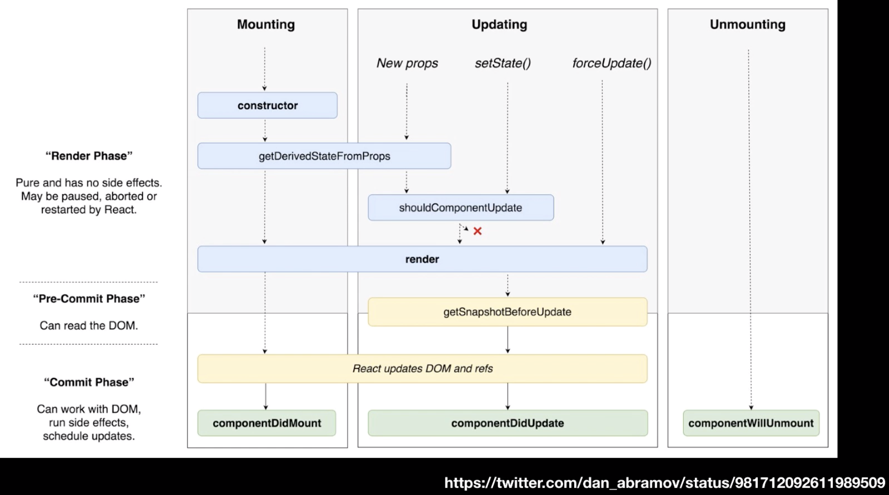

# LifeCycle API

- 컴포넌트가 브라우저에 나타날때, 사라질때 그리고 업데이트 될 때, 호출 되는 API

### Mounting

	- 컴포넌트가 브라우저 상에 나타난다.

### Updating

- 컴포넌트의 props가 바뀌거나, state가 바뀌었을 때 update라고 하고 

### Upmounting

- 컴포넌트가 브라우저에서 사라질 때

### constructor

	-  컴포넌트 생성자 함수, 컴포넌트가 새로 만들어질 때마다 함수 호출
	-  만든 컴포넌트가 처음 브라우저상에 나타나게 될 때 만들어지는 과정에서 가장 먼저 실행 되는 함수
	-  컴포넌트가 가질 초기설정을 한다던지, 컴포넌트가 만들어지는 과정에서 미리 해야 할 작업이 있으면 constructor에서 처리함

### getDerivedStateFromProps

- props로 받은 값을 주로 state에다가 동기화 하고 싶을 때 사용
- mouting 과정에서, updating 과정에서도 props가 바뀌게 되면 실행 된다.

### render

- 어떤 DOM을 만들게 될지
- 내부 태그들에는 어떤 값을 넣을지 정함

### componentDidMount

- 컴포넌트가 화면에 나타나게 됐을 때 호출 됨 
- 외부라이브러리, 디씨, 차티스트 
- 특정 DOM에 차트를 넣거나, 네트워크 요청시 사용
- 만든 컴포넌트가 나타나는 시점에 어떤 작업을 하겠다라는 것을 명시 함
- 이벤트를 리스닝 하거나, api를 요청하거나

### shouldComponentUpdate

- 컴포넌트가 업데이트 되는 성능을 최적화 시킬 때 사용

- 부모 컴포넌트 리렌더링 시 불필요한 경우 자식 컴포넌트가 리렌더링 하는것을 방지하는 목적으로 shouldComponentUpdate를 사용

- true값 또는 false 값 반환 가능 

  props와 state가 바뀌었을 때 false로 반환하면 렌더가 되지 않기 때문에 자원 절약 가능

- virtual DOM에 렌더 여부 결정

### getSnapshotBeforeUpdate

- 렌더 후 브라우저에 구현되기 바로 직전 호출되는 함수
- 스크롤 위치, 해당 DOM의 크기 등을 정할 때
- 실제 DOM에 변화 발생
- 이 API를 통해 DOM 변화가 일어나기 직전의 DOM 상태를 가져오고, 여기서 리턴하는 값은 componentDidUpdate에서 3번째 파라미터로 받아올 수 있음

### componentDidUpdate

- 이전의 updating 작업을 마치고 component가 update 되었을 때 호출 되는 함수

### componentWillUnmount(사라짐)

- Ummounting 되며 브라우저가 사라질 때 나타나는 함수
- componentDidMount에서 만든 이벤트를 없애는 작업

[누구든지 하는 리액트: 초심자를 위한 react 강좌](https://www.inflearn.com/course/react-velopert/)

[React](https://ko.reactjs.org/docs)

[누구든지 하는 리액트](http://react-anyone.vlpt.us/)

