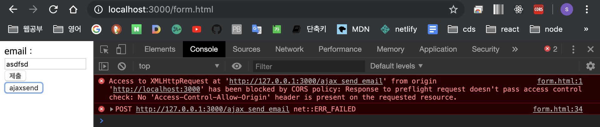
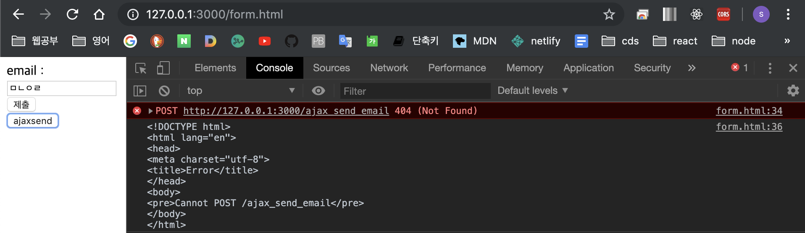

# HTTP 접근 제어 (CORS)

- **cors**는 Cross-Origin Resource Sharing의 약자이다
- cors표준은 웹브라우저가 사용하는 정보를 읽을 수 있도록 허가된 출처 집합을 서버에게 알려주도록 허용하는 HTTP 헤더를 추가함으로써 동작


## CORS ERROR



- 흔히 볼수 있는 CORS ERROR

- 위와 같이 ajaxsend 요청을 보내면 크롬브라우저에서  에러메세지를 콘솔에 출력

- 위와 같은 에러는 보안상의 이유로 브라우저들이 다른 도메인에게 xhr 요청을 보내는 것을 제한해 놓은것이다.

## CORS ERROR 해결하기 위해

1. Header 부분에 **'Access-Control-Allow-Origin', '*'** 추가

```javascript
      function sendAjax(url, data) {
        var data = { email: data };
        data = JSON.stringify(data);
        // 문자열을 json형태로
        var xhr = new XMLHttpRequest();
        xhr.open('POST', url);
        xhr.setRequestHeader('Content-Type', 'application/json');
        xhr.setRequestHeader('Access-Control-Allow-Origin', '*');
        xhr.setRequestHeader('Access-Control-Allow-Credentials', 'true');
        // 서버로 보낼때 json형태의 데이터를 보냄
        xhr.send(data);
        xhr.addEventListener('load', function() {
          console.log(xhr.responseText);
        });
      }
```

- 위와 같이 추가를 하였으나 동일한 에러메세지 출력

2. 주소를 localhost:3000이 아닌 **127.0.0.1:3000"으로 변경

   

- 성공


## 결론

Access to XMLHttpRequest at 'http://127.0.0.1:3000/ajax_send_email' from origin 'http://localhost:3000' has been blocked by CORS policy: Response to preflight request doesn't pass access control check: No 'Access-Control-Allow-Origin' header is present on the requested resource.

위의 에러를 해결하기 위해서는 헤더 부분에 추가를 해주는 것 뿐만 아니라 크롬은 localhost에서는 CORS 요청이 안 되도록 막아두었기 떄문에 주소를 127.0.0.1로 변경 한다.


