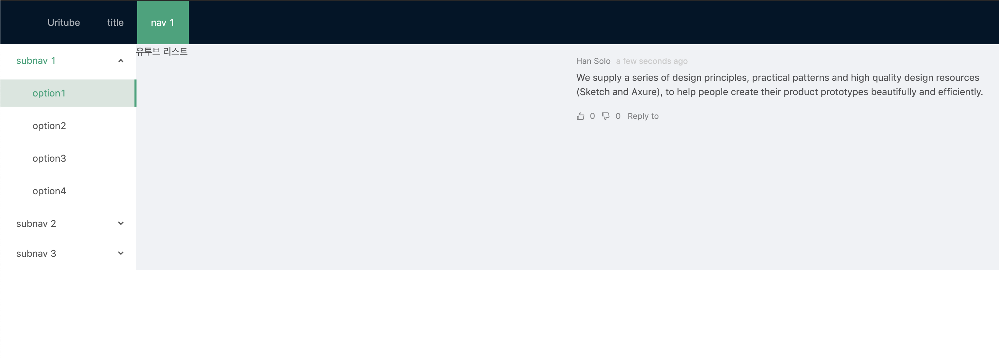
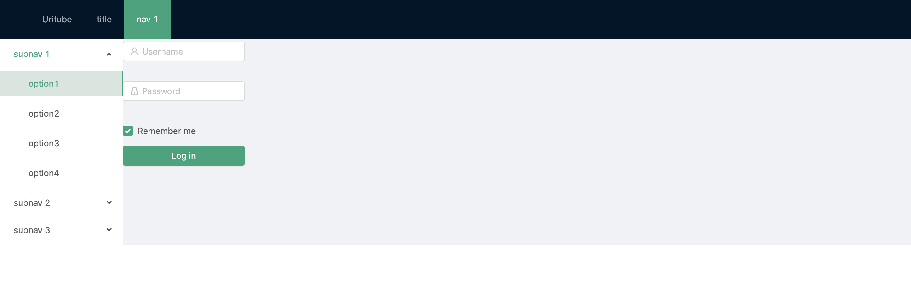

## 라우트 속 라우트



```jsx
<Route path="/community/:cate" component={LayoutForm} />
```

컨텐츠 부분에 여러가지 컴포넌트를 가져오기 위해 LayoutForm 안에 라우터를 사용

- LayoutForm Component

```jsx
<div className="contents">
	<Switch>
		<Route exact path="/community/login" component={LoginForm} />
		<Route exact path="/community/signup" component={SignUp} />
		<Route exact path="/community/userinfo" component={UserInfo} />
		<Route exact path="/community/:cate" component={ContentForm} />
	</Switch>
</div>
```

컨텐츠 부분에 다시 라우트를 설정해 주어 컴포넌트가 보여질 수 있도록 설정

