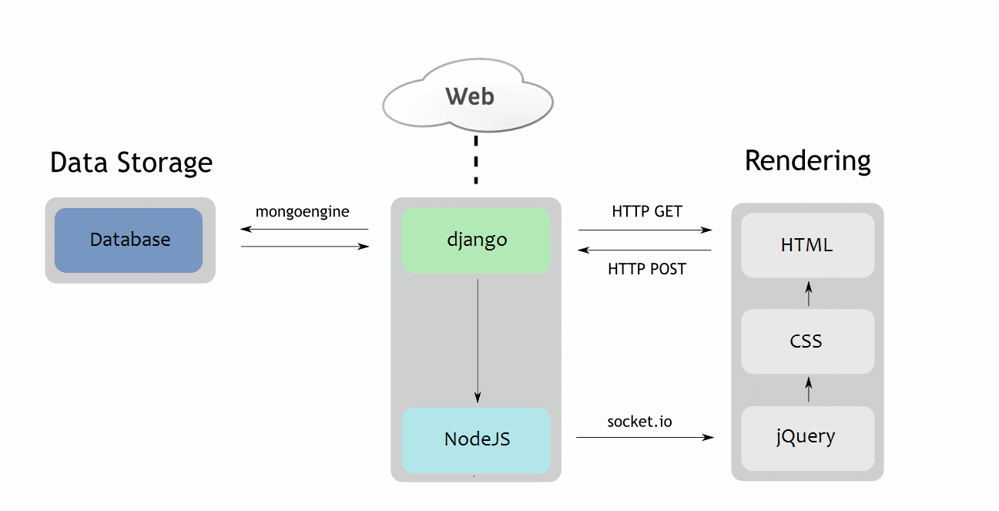

## Django와 Node.js 연결

- 기본적으로 Node.js는 Socket.io를 사용하여 Real Time 또는 multiplayer 기능을 적용시키기위해 Django 프레임 워크에 사용한다.
- Django는 요구사항을 스케치 하는데 유용함
- Node.js로 실시간 데이터 검색을 구축하고 Django가 비밀번호 재설정과 같은 유지 관리 기능을 처리하게 한다.

### Django And Node.js Connection Model

- django에서 Node.js로 push Request Socket to Node.js해줘서 Node.js가 Client에 내용을 보여주는 형식 

- django는 Node.js에 관여하지 않고 Client와 Node.js가 통신하는 방식

[How to use both Django & NodeJS as backend for your application](https://www.cuelogic.com/blog/how-to-use-both-django-nodejs-as-backend-for-your-application)

[How to intergrate Django server with Nodejs SocketIO server](https://stackoverflow.com/questions/53440785/how-to-integrate-django-server-with-nodejs-socketio-server)

[Realtime Django Using Node.js and Socket.IO](http://www.maxburstein.com/blog/realtime-django-using-nodejs-and-socketio/)

