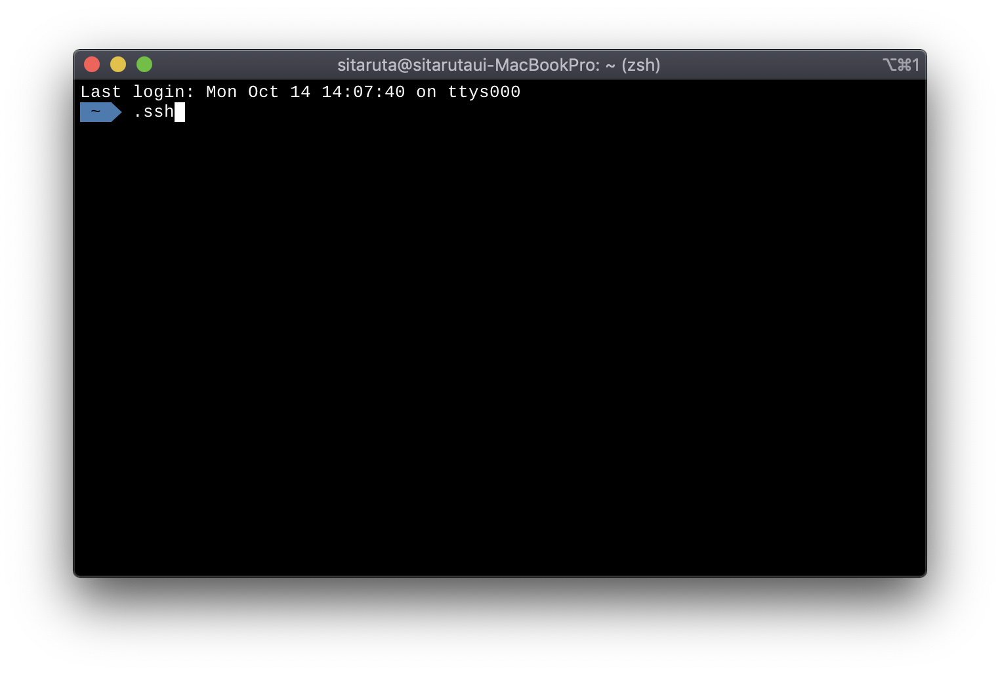
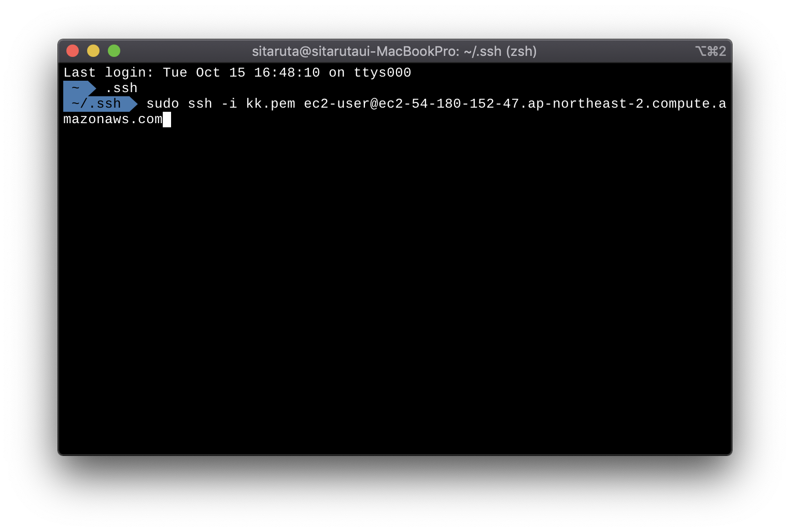
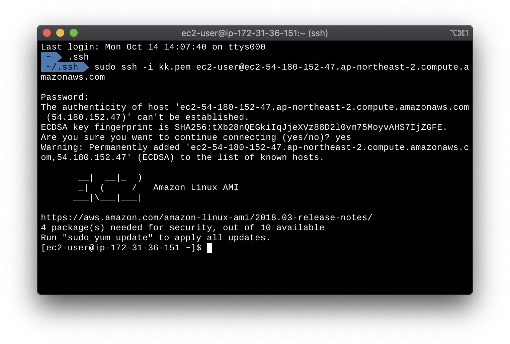
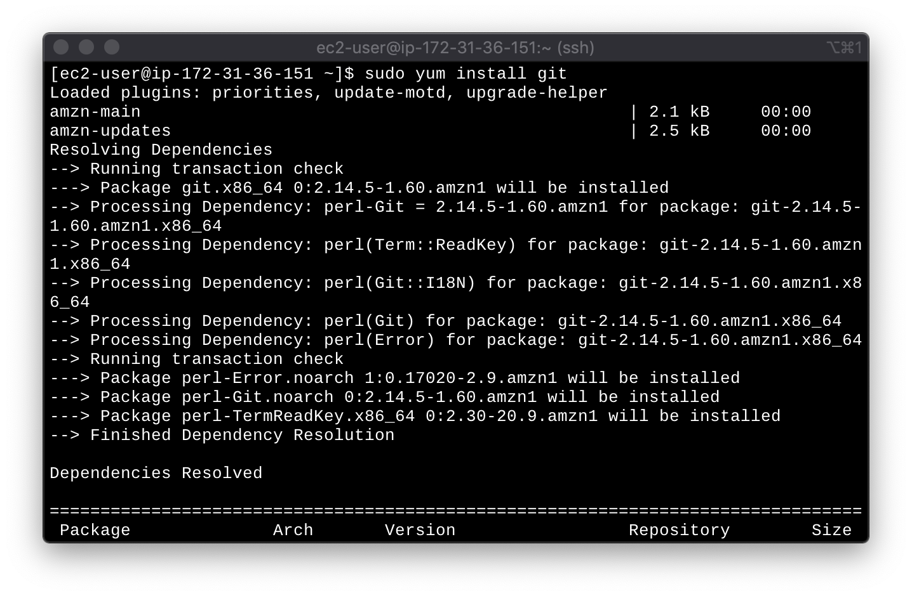
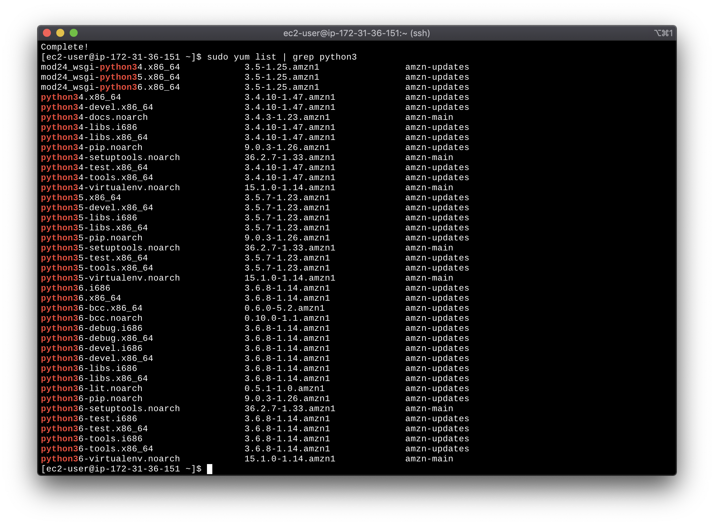
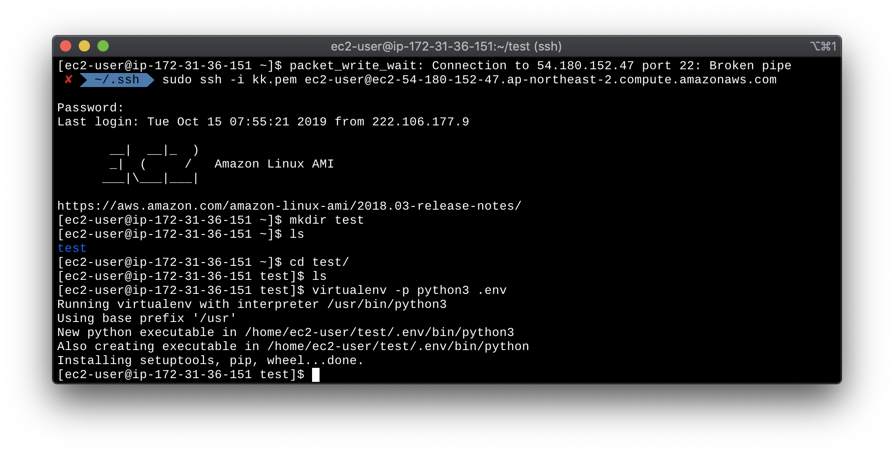
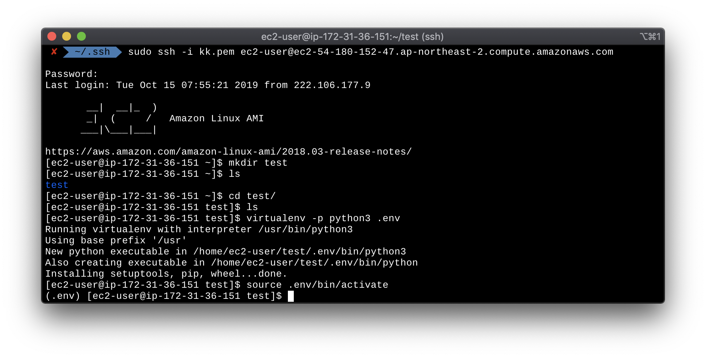
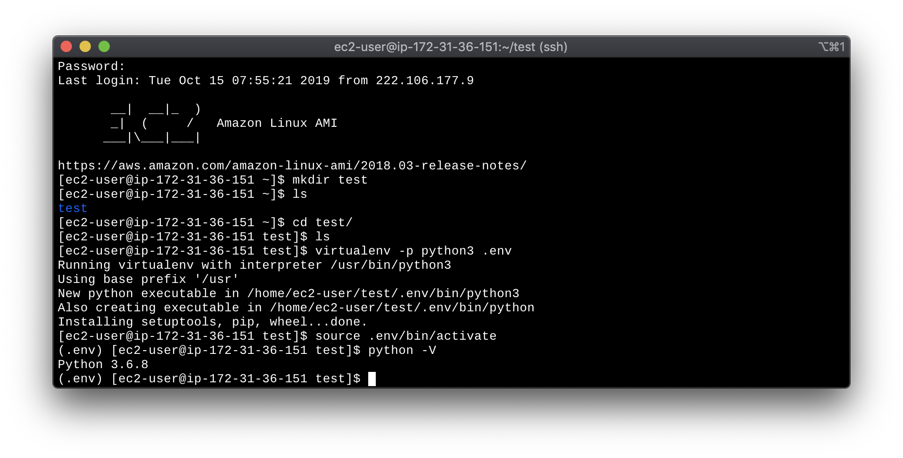
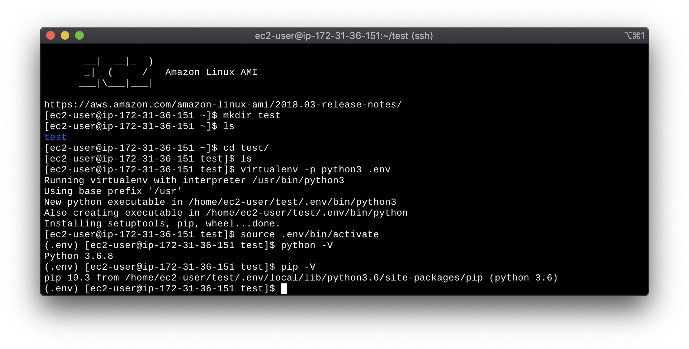

## EC2 Linux에서 Python 환경 세팅 하기

- Ubuntu가 아닌 EC2 Linux 환경에서 세팅하는 법입니다.
- 사실 알고보면 별거 아니지만 혹시나 나처럼 헤매는 사람들을 위해 작성합니다.
- RDS를 쓰지 않고 EC2에서 Django서버와 Mysql을 동시에 사용합니다.

### 1. ssh 접속

- 우선 EC2에 접속하기위해 로컬에서 pem key가 저장된 .ssh 폴더로 이동 한다.
- .ssh 폴더로 이동 후 저장된 pem key로 만들어진 EC2 퍼블릭 DNS(IPv4)에 접속한다.

- 위의 명령어대로 접속하고 yes를 입력하고 정상적으로 접속 되었다면 아래의 화면이 보일 것이다.

### 2. Git 설치

- EC2에 Git 설치 명령어는 "sudo yum install git"이다.

### 3. Python3 설치

- EC2 Linux는 기본적으로 Python2가 설치 되어 있다. 하지만 Python3는 따로 설치 해야 한다.

- "sudo yum list | grep python3"를 입력하면 Amazon Linux에서 설치 가능한 python3의 목록을 검색 할 수 있다.

- 여기서 원하는 python 버전을 설치 한다. "sudo yum install python36" 또는 "sudo yum istall python3X"

### 4. MySQL 설치

- MySQL도 Python이나 Git과 설치법이 동일 하다
- "sudo yum list | grep mysql5"를 입력하면 Amazon Linux에서 설치 가능한 MySQL의 목록을 볼 수 있다.
- "sudo yum install mysql57" 또는 "sudo yum install mysql00" 버전을 입력해준다.

### 5. MySQL server 실행

- Amazon Linux에서 mysql 서버 실행 명령어는 "sudo service mysqld start"이다.

### 6. Python 가상환경 설치

- Amazon Linux에 virtualenv가 설치 되어 있으므로 virtualenv를 통해 Python3 가상환경을 만들어 python2와 pip2와 분리 시켜 준다.
- 원하는 디렉토리에 "virtualenv -p python3 directory" 명령어를 통해 python3 환경을 설치 한다.

- .env 로 생성한 이유는 숨김폴더로 할 수 있기 때문이다.

### 7. Python 가상환경 실행

- 다른 가상환경 실행 명령어와 같이 "source directory/bin/activate"로 가상환경에 접속한다.

- 앞에 (directory)라고 되어 있으면 가상환경에 접속이 된것이다.
- python -V (V는 대문자로 입력한다.)로 현재 파이선 버전을 확인 한다.

- 이때 위의 사진 처럼 python 3.X.X가 나오면 정상적인 python3 가상환경으로 만들어 진것이다.
- pip -V를 하여 pip version도 확인 하여 pip도 정상적으로 설치 되었는지 확인 한다.

- 위의 단계 까지가 python3, Mysql5.X, python 가상환경 Setup 이다. 

- 다음 블로그에서는 django 및 pip 종속환경 설치 시 오류를 해결 해 보겠다.

