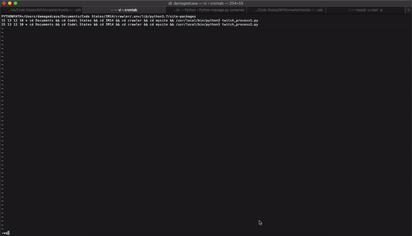
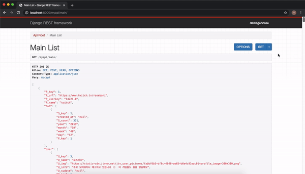
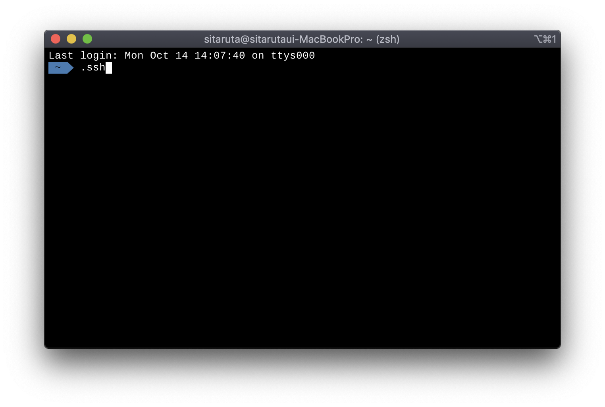
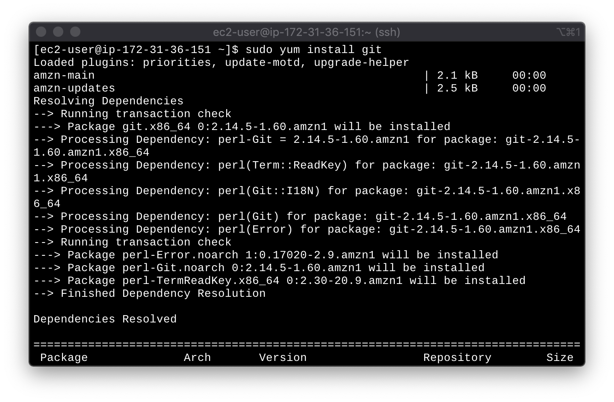
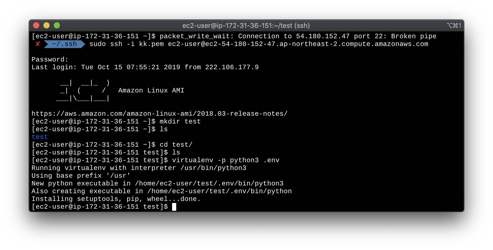
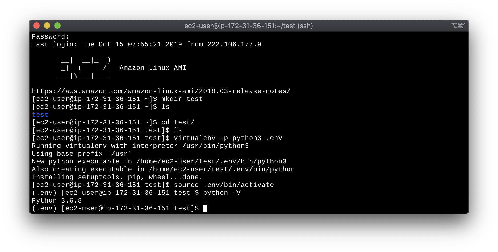

## Codestates 4주 프로젝트 Platform Crawler EC2 python 환경 Setup

### Platform Crawler

- 코드스테이츠에서 이머시브 4주 프로젝트 동안 ILIO 기업 협업으로 Platform Crawler 만들기를 선택해서 프로젝트를 진행했습니다.
- Platform Crawler는 아프리카, 트위치, 유튜브의 BJ의 페이지를 크롤링하여 유의미한 데이터들을 DB에 저장하고 그 데이터를 활용 BJ의 성장과 하락을 볼 수 있도록 한 APP입니다.
- https://slides.com/sariputaupati/deck 링크에서 프로젝트 상세 설명을 볼 수 있습니다.

#### 1. Platform Crawler 프로세스

- 기본데이터인 크리에이터의 Number와 url이 들어 있는 Excel 파일을 DB로 옮긴후 크롤러 Script는 creater DB table에서 url을 가져와서 web에서 크리에이터의 데이터를 가져옵니다.
- 일차적으로 가져온 데이터는 DB에 저장이 되고, 그 후 일별, 주별, 월별의 데이터는 장고서버가 다시 기록 합니다.

#### 2. Platform Crawler 실행

- 구동시 Crontab을 사용하여 일정 시간에 Crawler가 실행 되도록 합니다.

- Data

### EC2 python 환경 Setup

- Ubuntu가 아닌 EC2 Linux 환경에서 세팅하는 법입니다.
- 사실 알고보면 별거 아니지만 혹시나 나처럼 헤매는 사람들을 위해 작성합니다.
- RDS를 쓰지 않고 EC2에서 Django서버와 Mysql을 동시에 사용합니다.

### 1. ssh 접속

- 우선 EC2에 접속하기위해 로컬에서 pem key가 저장된 .ssh 폴더로 이동 한다.
- .ssh 폴더로 이동 후 저장된 pem key로 만들어진 EC2 퍼블릭 DNS(IPv4)에 접속한다.

- 위의 명령어대로 접속하고 yes를 입력하고 정상적으로 접속 되었다면 아래의 화면이 보일 것이다.

### 2. Git 설치

- EC2에 Git 설치 명령어는 "sudo yum install git"이다.

### 3. Python3 설치

- EC2 Linux는 기본적으로 Python2가 설치 되어 있다. 하지만 Python3는 따로 설치 해야 한다.

- "sudo yum list | grep python3"를 입력하면 Amazon Linux에서 설치 가능한 python3의 목록을 검색 할 수 있다.

- 여기서 원하는 python 버전을 설치 한다. "sudo yum install python36" 또는 "sudo yum istall python3X"

### 4. MySQL 설치

- MySQL도 Python이나 Git과 설치법이 동일 하다
- "sudo yum list | grep mysql5"를 입력하면 Amazon Linux에서 설치 가능한 MySQL의 목록을 볼 수 있다.
- "sudo yum install mysql57" 또는 "sudo yum install mysql00" 버전을 입력해준다.

### 5. MySQL server 실행

- Amazon Linux에서 mysql 서버 실행 명령어는 "sudo service mysqld start"이다.

### 6. Python 가상환경 설치

- Amazon Linux에 virtualenv가 설치 되어 있으므로 virtualenv를 통해 Python3 가상환경을 만들어 python2와 pip2와 분리 시켜 준다.
- 원하는 디렉토리에 "virtualenv -p python3 directory" 명령어를 통해 python3 환경을 설치 한다.

- .env 로 생성한 이유는 숨김폴더로 할 수 있기 때문이다.

### 7. Python 가상환경 실행

- 다른 가상환경 실행 명령어와 같이 "source directory/bin/activate"로 가상환경에 접속한다.

- 앞에 (directory)라고 되어 있으면 가상환경에 접속이 된것이다.
- python -V (V는 대문자로 입력한다.)로 현재 파이선 버전을 확인 한다.

- 이때 위의 사진 처럼 python 3.X.X가 나오면 정상적인 python3 가상환경으로 만들어 진것이다.
- pip -V를 하여 pip version도 확인 하여 pip도 정상적으로 설치 되었는지 확인 한다.

- 위의 단계 까지가 python3, Mysql5.X, python 가상환경 Setup 이다. 

- 다음 블로그에서는 django 및 pip 종속환경 설치 시 오류를 해결 해 보겠다.

