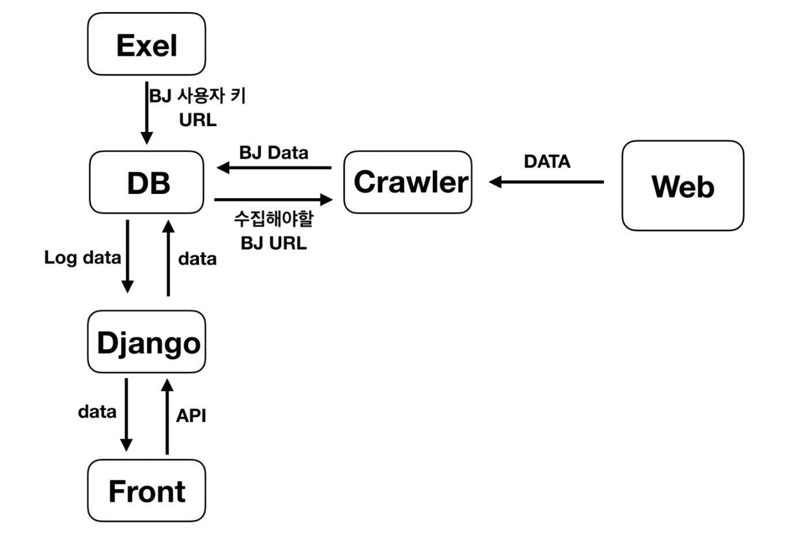

## 플랫폼 크롤러 만들기

### 목표

- Python, Django, DB, AWS 익숙해지기
- 유튜브, 아프리카, 트위치에서 원하는 크리에이터들의 데이터를 수집하여 인플루언서의 성장, 하락 분석
- 무중단 크롤링(Daemon 사용)
- Front 보다 Back 위주로

### 사용하고자 하는 스택

- python, django, mysql(mongoDB), daemon, aws(ec2, rds, airflow, boto3), docker
- daemon, airflow, boto3, docker는 사용해 본적이 없음

### 예상 데이터 흐름도

### 저장하고자 하는 데이터

- 플랫폼 별로 인플루언서 데이터 저장
- 인플루언서 : ID, 생성일, 주소, 이미지, 이름
- 인플루언서-비디오 : 비디오 개수, 비디오 좋아요 수, 비디오 총 시청 수, 비디오 댓글 수(일간, 주간, 월간 차이)
- 인플루언서-구독자: 구독자 수(일간, 주간, 월간 차이)

### 예상 기간

- 11월 11일 ~ 11월 30일

