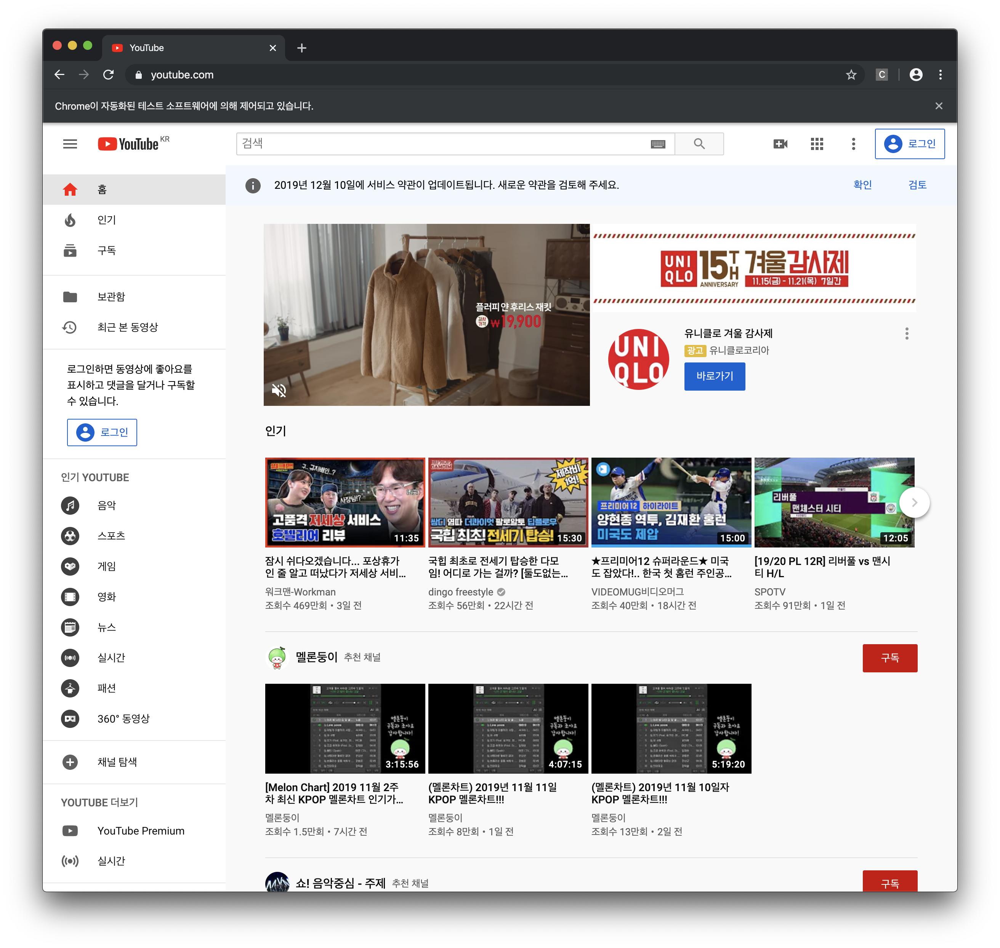

### Selenium 사용법 익히기

#### Selenium이란?

- Selenium은 브라우저를 자동화 합니다. 그것이 전부입니다. 무엇이든 하고자 함은 당신에게 전적으로 달려있습니다. 주로, 테스트 목적으로 웹 어플리케이션을 자동화하기 위한 것이지만, 그것에 국한되어 있지 않습니다. 지루한 웹 기반 작업도 자동화 가능합니다. [Selenium 공식 site](https://www.seleniumhq.org)
- 보통 사람이 브라우저를 탐색하고 데이터를 수집하듯이 Selenium은 사람이 데이터를 수집하는 방식을 사용하여 브라우저 동작을 자동화 해주고 사용자가 원하는 데이터를 수집힌다.
- 데이터를 수집하기를 원하는 사이트에서 데이터 API를 제공해준다면 그 API를 사용하여 데이터를 수집하면 되지만 보통은 API를 제공하지 않기 때문에 Selenium을 사용한다.

### Selenium 설치

- pip를 통해 Selenium을 설치한다.

```bash
pip install selenium
```

### WebDriver 설치

- Selenium은 WebDriver를 통하여 브라우저를 제어 하기 때문에 WebDriver도 설치한다.
- **WebDriver는 웹 페이지의 DOM요소를 조작하고 사용자 에이전트의 동작을 명령할 수있는 원격 제어 인터페이스입니다.** [Selenium WebDriver란 무엇입니까?]([https://riptutorial.com/ko/selenium-webdriver/example/5257/selenium-webdriver-%EB%9E%80-%EB%AC%B4%EC%97%87%EC%9E%85%EB%8B%88%EA%B9%8C-](https://riptutorial.com/ko/selenium-webdriver/example/5257/selenium-webdriver-란-무엇입니까-))
- [Chrome WebDriver를 다운받기](https://sites.google.com/a/chromium.org/chromedriver/downloads)

### Selenium으로 브라우저 열기

1. Selenium 모듈에서 webdriver 불러오기
2. Chrome webdriver path 설정하기
3. webdriver.Chrome(path)를 원하는 변수명에 입력하여 객체를 만들어 준다.
4. driver.get('url')으로 원하는 사이트의 url을 입력한다.
5. driver.close()로 webdriver를 종료한다.

```python
from selenium import webdriver
# selenium에서 webdriver를 사용할 수 있게 webdriver를 import 한다.
path = '/Users/sitaruta/Downloads/chromedriver'
# chromedriver의 위치를 지정한다.
driver = webdriver.Chrome(path)
# driver란 변수에 객체를 만들어 준다.
driver.get('https://www.youtube.com/')
# 원하는 사이트의 url을 입력하여 사이트를 연다.
driver.close()
# webdriver를 종료한다.
```

위와 같이 python 스크립트를 실행하면 

- 주소창 밑에 **Chrome이 자동화된 테스트 소프트웨어에 의해 제어되고 있습니다**라는 문구와 함께 Chrome이 실행 된다.



### 참고 사이트

[문과생도 할 수 있는 웹 크롤링](https://sacko.tistory.com/13)

[Selenium으로 무적 크롤러 만들기](https://beomi.github.io/gb-crawling/posts/2017-02-27-HowToMakeWebCrawler-With-Selenium.html)


