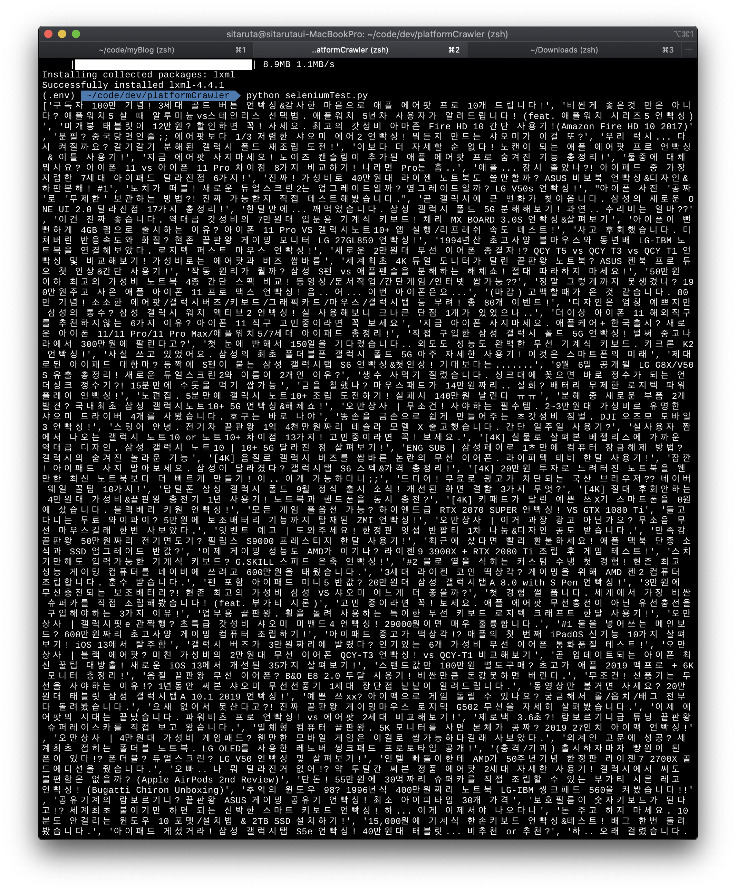

## Selenium 유튜브 데이터 크롤링

- BeatifulSoup과 Selenium을 사용하여 Youtube에서 데이터를 가져옵니다.
- [Selenium 익숙해지기](https://upatisariputa.netlify.com/prj002/) 이어서 진행 됩니다.

### BeautifulSoup 설치하기

- BeautifulSoup은 HTML과 XML 파일로부터 데이터를 추출하기 위한 파이썬 라이브러리입니다. 원하는 parser와 함께 parse 트리를 검색, 변경합니다. [BeautifulSoupDoc](https://www.crummy.com/software/BeautifulSoup/bs4/doc.ko/)
- BeautifulSoup은 HTML 문서들을 Python 객체들로 변경해줍니다.
- BeautifulSoup의 설치는 아래와 같이 합니다.

```bash
pip install beautifulsoup4
```

### 유튜브 Page 스크롤 내리기

- 유튜브는 스크롤을 내리지 않으면 video소스가 보이지 않기 때문에 스크롤을 내려주는 작업을 해야 합니다.

```python
body = driver.find_element_by_tag_name('body')
# body를 스크롤하기 위해 tagname이 body로 되어있는것을 추출합니다.
num_of_pagedowns = 10
# 페이지 다운을 몇 번 할지 정해줍니다.(변수로 지정하지 않고 바로 숫자를 입력해도 상관 없습니다.)
while num_of_pagedowns:
  body.send_keys(Keys.PAGE_DOWN)
  # Selenium이 페이지 다운을 할 수 있도록 코드를 입력합니다.
  time.sleep(2)
  # 얼마의 시간 뒤에 다시 페이지를 내릴지 시간을 정합니다. 스크롤을 내린 페이지가 로드 될 수 있도록 시간차를 줍니다.
  num_of_pagedowns -= 1
```

### 로드 된 HTML을 BeautifulSoup으로 분석하기

```python
html = driver.page_source
# 로드 된 페이지 소스를 html이란 변수에 저장합니다.
soup = BeautifulSoup(html, 'lxml')
# html을 'lxml' parser를 사용하여 분석합니다.
all_title = soup.find_all('a','yt-simple-endpoint style-scope ytd-grid-video-renderer')
# 조건에 맞는 모든 태그들을 가져옵니다.
title = [soup.find_all('a','yt-simple-endpoint style-scope ytd-grid-video-renderer')[n].string for n in range(0,len(all_title))]
# title이란 변수에 저장합니다.
print(title)
```

- 파일을 실행시키면 아래와 같은 결과가 나옵니다. 



### 현재까지의 코드

```python
from bs4 import BeautifulSoup
import time
from selenium import webdriver
from selenium.webdriver.common.keys import Keys
path = 'chromedriver 경로'
driver = webdriver.Chrome(path)

delay = 3
driver.implicitly_wait(delay)
driver.get('추출하고자 하는 youtube video url')
driver.maximize_window()

body = driver.find_element_by_tag_name('body')

num_of_pagedowns = 10
while num_of_pagedowns:
    body.send_keys(Keys.PAGE_DOWN)
    time.sleep(2)
    num_of_pagedowns -= 1

html = driver.page_source
soup = BeautifulSoup(html, 'lxml')
all_title = soup.find_all('a','yt-simple-endpoint style-scope ytd-grid-video-renderer')
title = [soup.find_all('a','yt-simple-endpoint style-scope ytd-grid-video-renderer')[n].string for n in range(0,len(all_title))]
print(title)

driver.close()
```

