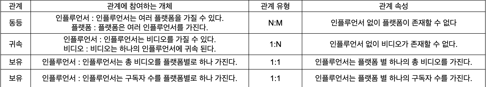

## DB 스키마 설계

- [프로젝트004](https://upatisariputa.netlify.com/prj004/) 에 이어서 진행 됩니다.
- [관계형 데이터베이스 설계 및 구축](https://advenoh.tistory.com/31) 을 따라서 DB 스키마를 설계합니다.

### 2.3 분석한 내용으로 ERD 생성하기

객체, 관계 정리를 잘 하면 쉽게 ERD를 만들어볼 수 있다. 추출한 내용을 가지고 다이어그램으로 정리하고 큰 그림을 보면서 전체 모델을 이해할 수 있다. [관계형 데이터베이스 설계 및 구축](https://advenoh.tistory.com/31) 에서 사용한 draw.io를 나도 사용해 보겠다. 

## 우선 크롤러 프로토타입 모듈을 만들어서 데이터를 본 다음 DB를 설계하겠습니다. 그러므로 이 페이지는 추후 다시 업데이트 됩니다.

### 참고 사이트

- [관계형 데이터베이스 설계 및 구축](https://advenoh.tistory.com/31)