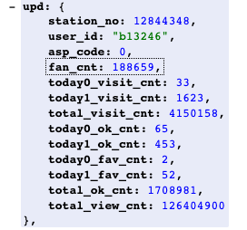

## 크롤러 프로토타입 모듈

- 우선적으로 크롤러 프로토타입 모듈을 만들어 어떠한 데이터들이 어떻게 받아지는지를 알아야 합니다.
- 이전 프로젝트 때 아프리카tv와 트위치는 api로 데이터를 받아 왔습니다.
- 이번에는 리팩토링을 하면서 각각을 OOP에 입각하여 만드려고 하겠습니다.

### 가져와야 하는 데이터

- 크리에이터 : ID, 생성일, 주소, 이미지, 이름
- 크리에이터-각비디오 : 이름, 주소, 조회수, 좋아요수, 댓글 수
- 크리에이터-총비디오 : 비디오 개수, 비디오 좋아요 수, 비디오 총 시청 수, 비디오 댓글 수
- 크리에이터-구독자 : 구독자 수

### 아프리카tv API를 사용하여 데이터 받아오기

- 아프리카tv는 api가 있으므로 api로 데이터를 받아 오면 된다.
- 아프리카tv api는 매우 친절하므로 내가 원하는 데이터를 다 가져올 수 있다.

- 각각의 비디오의 데이터 또한 api로 가져올 수 있다.

다음 블로그에서는 트위치 API를 사용하여 데이터를 받아 오겠다.