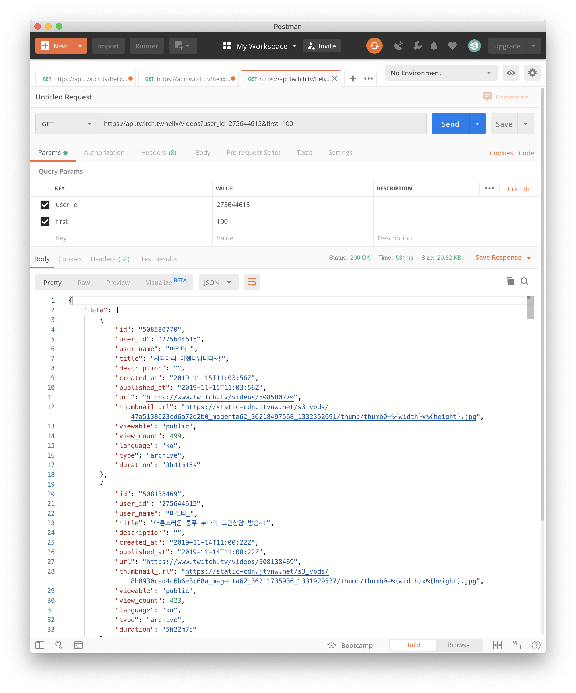
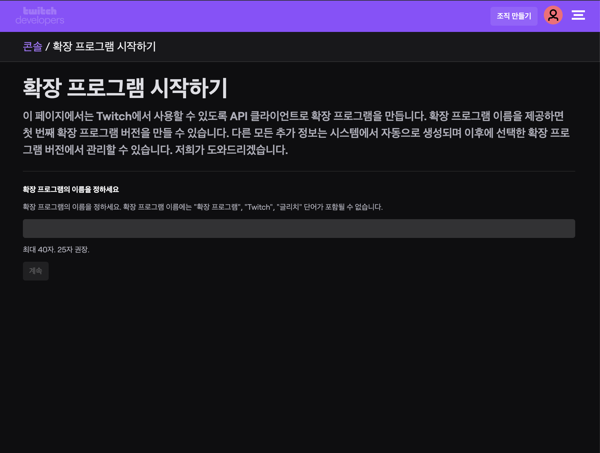

## 크롤러 프로토타입 모듈

- 우선적으로 크롤러 프로토타입 모듈을 만들어 어떠한 데이터들이 어떻게 받아지는지를 알아야 합니다.
- 이전 프로젝트 때 아프리카tv와 트위치는 api로 데이터를 받아 왔습니다.
- 이번에는 리팩토링을 하면서 각각을 OOP에 입각하여 만드려고 하겠습니다.

### Twitch API를 사용하여 데이터 받아오기

- twitch도 api가 있으므로 api로 데이터를 받아 오면 된다.
- twitch도 api가 매우 친절하므로 내가 원하는 데이터를 다 가져올 수 있다.
- 헤더에 Client ID를 넣어야 하기 때문에 Postman으로 get요청을 보냈다.
- 각각의 비디오 정보 또한 api로 가져올 수 있다.

### Twitch API Client ID 발급받기

- Twitch API를 사용하기 위해서는 GET요청을 보낼시에 Client ID값을 Header에 넣어서 보내야 한다. 
- 이중 인증이 안 되어있다면 이중인증을 해준 후에 [트위치 개발자](https://dev.twitch.tv/) 페이지에 가서 Create an Extension을 클릭한다.

- 확장프로그램을 만들면 Twitch에서 Twitch API 클라이언트 ID를 발급해준다. 그럼 그 ID를 사용하여 Header에 클라이언트 ID를 넣고 Twitch API를 사용하면 된다.

다음 블로깅에서는 트위치, 아프리카tv API를 사용하여 script를 만들어 보겠다.