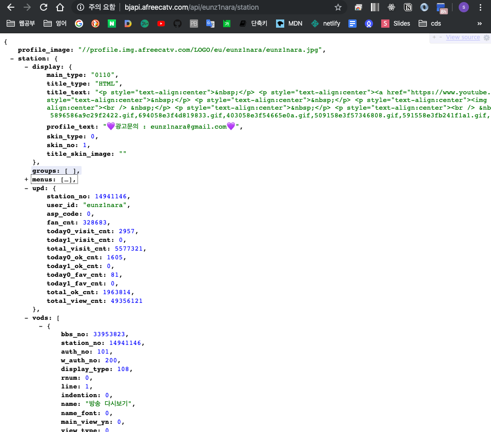
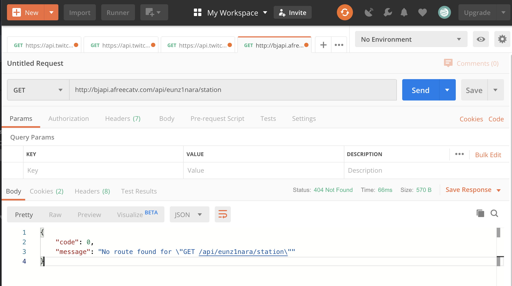
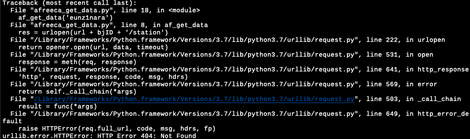
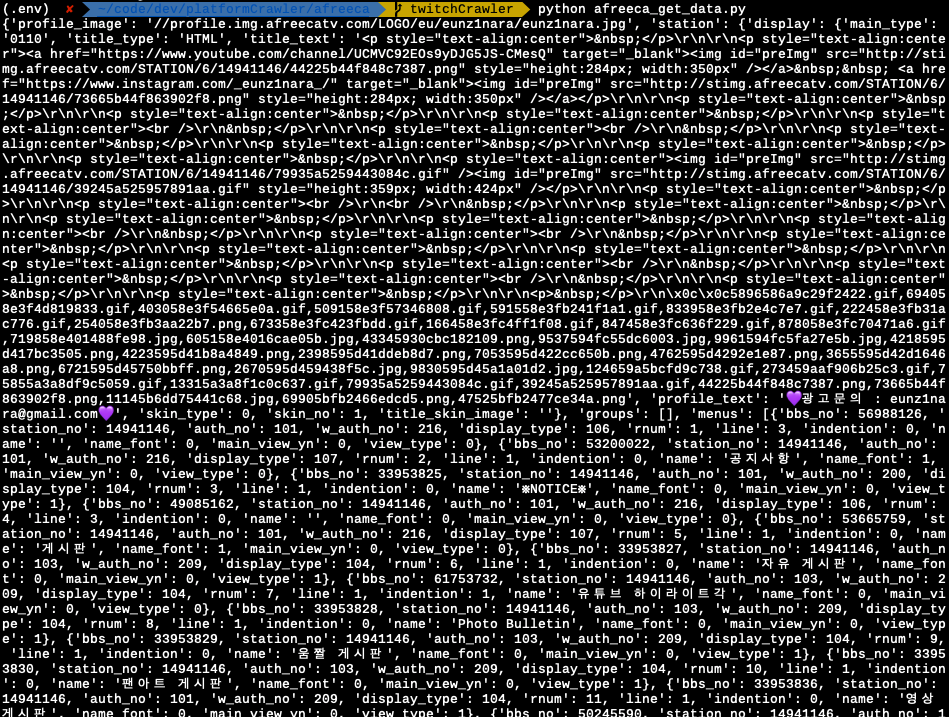

## 크롤러 프로토타입 모듈 - Afreeca API 모듈

- 우선적으로 크롤러 프로토타입 모듈을 만들어 어떠한 데이터들이 어떻게 받아지는지를 알아야 합니다.
- 이전 프로젝트 때 아프리카tv와 트위치는 api로 데이터를 받아 왔습니다.
- 이번에는 리팩토링을 하면서 각각을 OOP에 입각하여 만들겠습니다.


### requests HTTPError HTTP Error 404 : Not Found

- 처음에는 트위치와 동일하게 reuests모듈을 사용하여 데이터를 가져오려고 했다. 

```python
import requests

def af_get_data(bjID):
  res = requests.get('http://bjapi.afreecatv.com/api/' + bjID + '/station').json()
```


- 아프리카TV API를 사용하면서 twitch 할 당시와는 다르게 에러를 만났다.


- 브라우져로 API를 입력하면 가져와졌으나 Python 스크립트로 requests 요청을 보내면 위와 같이 에러 메세지가 나왔다.



- 처음에는 postman으로 요청을 보내도 안 되어서 요청형식이 잘못된것으로 파악했다. 그래서 url을 open 하고 open한 뒤에 나오는 데이터를 가져와야 하는걸로 생각을 하였다.



- 그래서 아래와 같은 형식으로 만들어 보았다.

```python
from urllib.request import Request, urlopen
import json


def af_get_data(bjID):
  res = Request('http://bjapi.afreecatv.com/api/' + bjID + '/station')
  res_open = urlopen(res)
  info = json.load(res_open)
```

- 그러나 또 오류가 발생하였다.



- 검색을 해보니 헤더값을 넣지 않으니 스파이더/봇 사용을 막기위해 afreeca에서 막아 놓은 것이었다. 그래서 [파이썬(Python)으로 HTML contents를 file로 저장할 때 HTTP Error 403: Forbidden 발생 시](https://sarc.io/index.php/development/806-python-html-contents-file-http-error-403-forbidden) 에 나와있는 대로 header값을 넣었다. 
- **headers={'User-Agent': 'Mozilla/5.0'})** 이 값을 url뒤에 넣으니 정상적으로 데이터를 가져왔다.



### Afreeca urllib와 requests

```python
from urllib.request import Request, urlopen
import json

def af_get_data(bjID):
  res = Request('http://bjapi.afreecatv.com/api/' + bjID + '/station', headers = {'User-Agent': 'Mozilla/5.0'})
  res_open = urlopen(res)
  info = json.load(res_open)
```

```python
import requests

def af_get_data(bjID):
  res = requests.get('http://bjapi.afreecatv.com/api/' + bjID + '/station', headers = {'User-Agent': 'Mozilla/5.0'}).json()
```

- 둘다 똑같은 결과를 내는 코드이다. 

- 그러나 위는 urllib를 사용하였고 아래는 requests를 사용하였다. 

- [requests VS urllib](https://sang-gamja.tistory.com/138) 이 블로그에 따르면 

  - 데이터를 보낼때 requests는 딕셔너리 형태, urllib는 인코딩하여 바이너리 형태로 전송
  - requests는 요청메소드(get, post)를 명시하지만 urllib는 데이터의 여부에 따라 get과 post요청을 구분
  - 없는 페이지 요청시 requests는 에러를 띄우지 않지만 urllib는 에러를 띄움

  의 차이가 있었다.


데이터를 가져왔으므로 DB를 만들어야 하나? 아니면 모듈을 제대로 만들고 DB를 만들어야 하나? 어차피 DB를 만들면 DB에 저장하는 모듈도 만들어야 하는데... 아.. youtube 크롤러 모듈을 먼저 만들어보겠다.