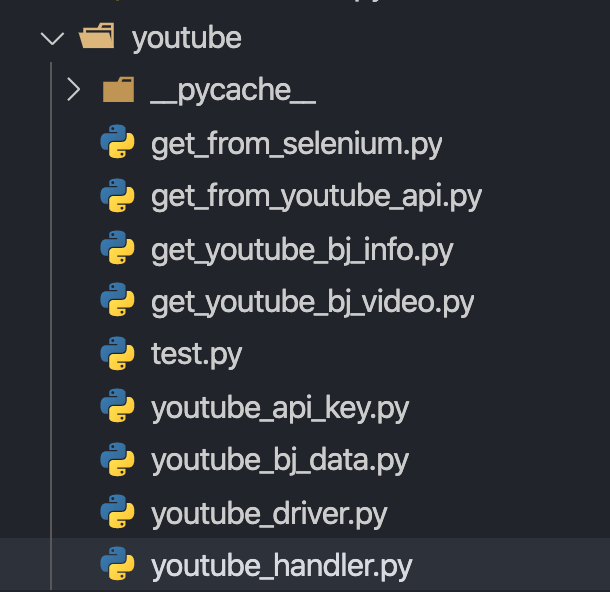
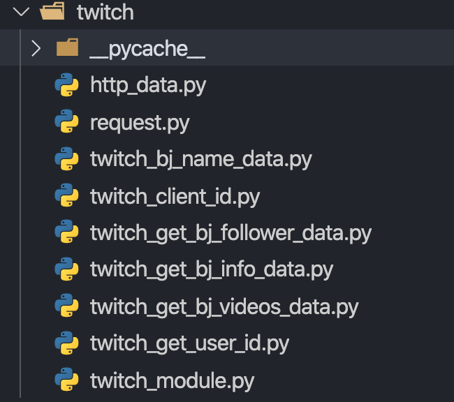
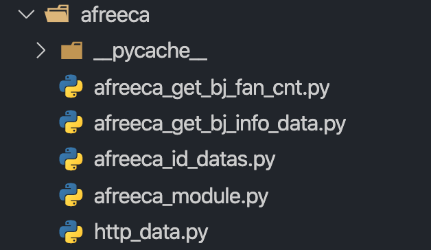

## 크롤러 프로토타입 모듈

### Youtube Handler



- 이 모듈들을 작동시켜주는 youtube_handler.py를 만든다.

```python
from get_from_youtube_api import get_from_youtube_api
from get_youtube_bj_info import video_url, get_bj_info
from get_youtube_bj_video import get_bj_video
from youtube_bj_data import bj_data
from youtube_driver import driver
## 각각의 모듈을 import 한다.

for data in bj_data:
	  get_from_youtube_api(data) # api로 크리에이터의 데이터 받아오기
    get_bj_info(data) # 크리에이터의 비디오 url 추출

    if isinstance(video_url, list):
        get_bj_video(video_url) # 각각의 비디오 데이터 추출

driver.quit()
```


### Twitch Handler



- 위 모듈들을 실행시키는 twitch_module(twitch_handler)를 만든다.

```python
from twitch_get_user_id import get_user_id, bj_ids_datas
from twitch_get_bj_videos_data import get_bj_video
from twitch_get_bj_info_data import get_bj_info
from twitch_get_bj_follower_data import get_bj_fw_data

get_user_id()

if len(bj_ids_datas) > 0:
    for id_data in bj_ids_datas:
        get_bj_info(id_data)
        get_bj_fw_data(id_data)
        get_bj_video(id_data)
```


### Afreeca Handler



- 위 모듈들을 실행시키는 afreeca_module(afreeca_handler)를 만든다.

```python
from afreeca_get_bj_info_data import bj_info_data
from afreeca_id_datas import id_datas
from afreeca_get_bj_fan_cnt import get_bj_fan_cnt


for id in id_datas:
    bj_info_data(id)
    get_bj_fan_cnt(id)
```

