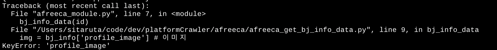
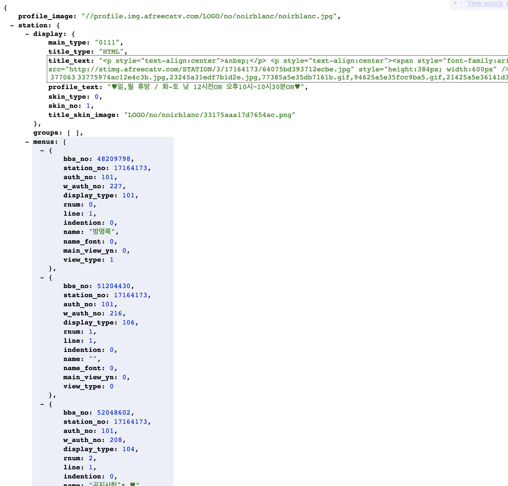
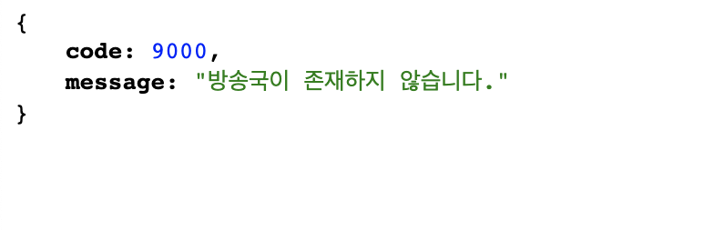
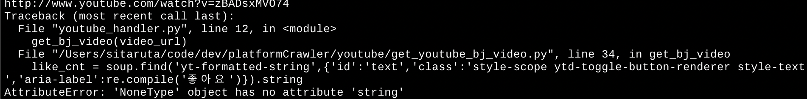
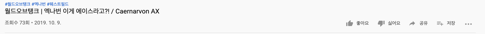
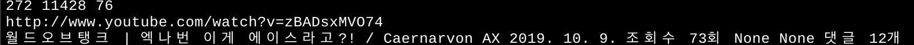

## 크롤러 프로토타입 모듈 - 에러 핸들링

### API 모듈 에러 핸들링

- 크롤링을 하면서 크리에이터가 더이상 방송을 하지 않아서 api로 가져올 데이터가 없는경우, 유튜브의 경우 좋아요가 없거나, 댓글이 없는 경우 오류를 발생시키고 크롤링이 중단이 되었다.

- 이렇게 에러를 내고 중단되는경우를 방지하기 위하여 파이썬에서는 try except를 사용하여 에러를 핸들링 한다. if를 사용해서 핸들링 하기도 해서 두가지 경우를 다 사용하였다.

- 아프리카에서는 크리에이터가 활동을 중단하여 api로 가져올 데이터가 없는 경우 아래와 같은 에러를 내고 스크립트는 종료된다.



- 정상적인 크리에이터의 api를 브라우저에서 볼때는 아래와 같다



- 사라진 크리에이터의 api를 브라우저에 볼때는 아래와 같다.



- 위와 같이 없는 크리에이터의 데이터를 가져올 때는 스크립트에서 에러를 발생하므로 try except로 에러를 핸들링 하였다.

```python
def bj_info_data(bj_id):
    try:
        bj_info = requests.get(url + bj_id + '/station', headers=headers).json()
        img = bj_info['profile_image'] # 이미지
        introduce = bj_info['station']['display']['profile_text'] # 소개
        name = bj_info['station']['user_nick'] # 닉네임
        fav_fan = bj_info['station']['upd']['fan_cnt'] # 즐찾 수
        t_view_cnt = bj_info['station']['upd']['total_view_cnt'] # 총 비디오 조회수
        signup = bj_info['station']['jointime'] # 생성일
        print(img, introduce, name, fav_fan, t_view_cnt, signup)
    except:
        pass
```

- try 구문에 있는 것들을 읽어 온 후 오류가 나면 데이터 베이스에 저장하지 않고 pass 하는 것이다.

### Selenium 모듈 에러 핸들링 

- 유튜브 크롤러 모듈에서 에러핸들링은 if로 처리를 해보았다.
- 여러모로 try, except가 좋지만 시도를 해보았다. 하지만 모든 예외의 경우를 처리해주지 못 하기 때문에 try, except로 바꿀 필요가 있다.



- 위와 같은 에러를 내는 이유는 비디오에 좋아요가 하나도 없기 때문에 BeatifulSoup이 좋아요의 태그를 가져오지 못하고 None으로 가져오기 때문에 발생하는 오류이다.



- if로 처리할 경우는 아래와 같이 처리를 하였다.

```python
# 태그를 가져오는 코드

video_title = soup.find('h1', 'title style-scope ytd-video-primary-info-renderer').string
upload_date = soup.find('div', {'id' : 'date'}).find('yt-formatted-string', 'style-scope ytd-video-primary-info-renderer').string
view_cnt = soup.find('span', 'view-count style-scope yt-view-count-renderer').string
like_cnt = soup.find('yt-formatted-string',{'id':'text','class':'style-scope ytd-toggle-button-renderer style-text','aria-label':re.compile('좋아요')})
unlike_cnt = soup.find('yt-formatted-string',{'id':'text','class':'style-scope ytd-toggle-button-renderer style-text','aria-label':re.compile('싫어요')})
comment_cnt = soup.find('ytd-comments', {'id' : 'comments'}).find('yt-formatted-string', 'count-text style-scope ytd-comments-header-renderer')

# 만일 가져온 태그가 None이 아니라면 .string을 붙여서 정상적으로 출력이 되게 한다.
if like_cnt is not None:
   like_cnt = like_cnt.string
if unlike_cnt is not None:
   unlike_cnt = unlike_cnt.string
if comment_cnt is not None:
   comment_cnt = comment_cnt.string

```



- 좋아요나 싫어요가 없는 경우 None으로 정상 출력 된다.