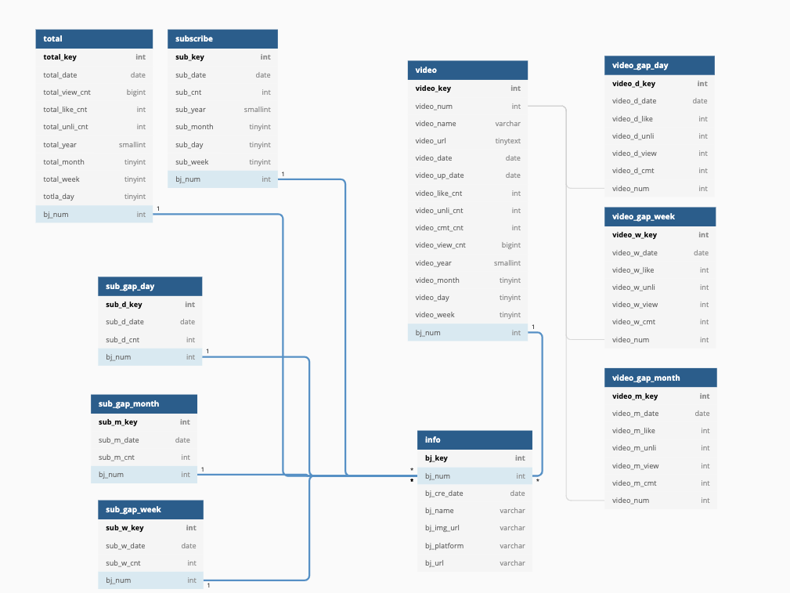
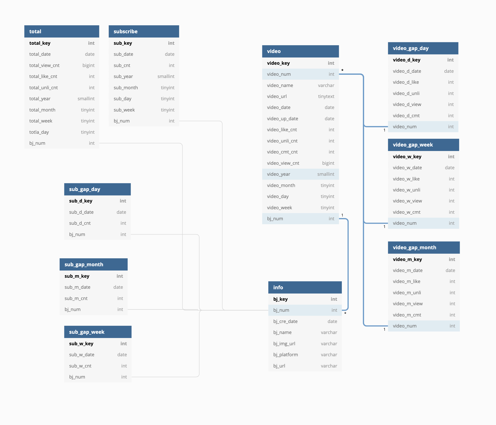

## DB 스키마

- [프로젝트 005](https://upatisariputa.netlify.com/prj005/) 에 이어서 진행 됩니다.

### DB 스키마 관계도

- info 테이블 : 크리에이터의 고유 넘버, 생성일, 이름, 이미지주소, 플랫폼, 크리에이터의 주소
- total 테이블 : total 테이블 생성일, 전체 조회수, 전체 좋아요, 싫어요 수, 테이블 생성 년, 월, 일, 주
- subscribe 테이블 : subscribe 테이블 생성일, 구독자 수, 테이블 생성 년, 월, 일, 주
- video 테이블 : 고유 넘버, 이름, 주소, video 테이블 생성일, video 생성일, 좋아요, 싫어요, 댓글 수, 테이블 생성 년, 월, 일, 주
- gap 테이블 : 테이블 생성일, 구독, 비디오, 데이터, 부모 테이블과 연결 하는 고유 넘버

(이미 테이블을 다 만들고 나서 안 거지만 total도 gap 테이블이 필요하다. 그러나 지금 gap테이블의 필요성에 대해서 고민중이다. gap테이블을 미리 만들어둘 필요가 있냐는 것이다. 미리 만들어두지 않고 필요할때 크리에이터의 total, video, subscirbe의 데이터를 불러오면 되는건가 아니면 만들어 두고나서 증가 또는 감소가 일정이상으로 진행되면 알람을 오게 만드는것도 괜찮을 듯 )

#### info > total, subscribe, video, subscribe_gap

- 크리에이터의 info에서 크리에이터의 고유넘버인 bj_num를 다른 테이블과 연결한다. 이렇게 되면 크리에이터의 고유 넘버로 크리에이터가 가지고 있는 total, 구독자수, 비디오가 조회가 가능하다.

#### video > video_gap

- 비디오 고유넘버를 비디오테이블에 만들어 두고 비디오 고유넘버를 gap테이블에 연결시켜서 각각의 비디오가 gap 테이블을 연결시킬수 있도록 하였다.

다음 장에서는 테이블 저장시 로직을 위해서 프로시저 생성에 대해서 블로깅 예정이다.

