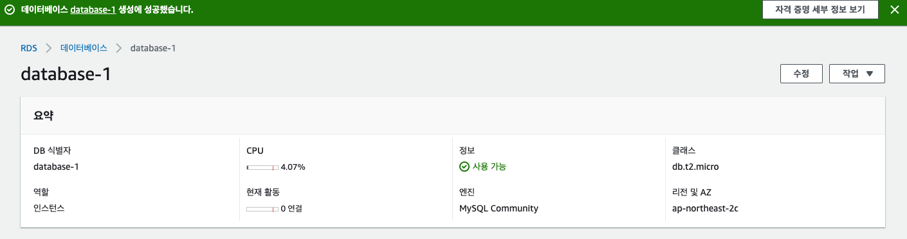

## AWS RDS 사용

- AWS RDS의 프리티어를 사용해서 DB를 만들겠다.

### RDS 만들기

- aws 콘솔로 가서 RDS를 선택한 다음 사이드바에서 데이터베이스를 선택한 후 데이터베이스 생성을 클릭한다.

- 데이터베이스 생성을 클릭했다면 아래와 같은 화면에서 MySQL 등을 선택한다.
- MySQL 5버전으로 한 이유는 8버전으로 할 경우 SQL 관리툴에서 접속이 안 되는 경우가 있기 때문에 5버전으로 생성하였다.

- 프리티어로 선택을 한다음 아래쪽으로 가서 데이터베이스 생성을 클릭한다.

- 데이터베이스 생성을 클릭하면 내가 지정한 이름과 비밀번호 대로 데이터베이스가 생성 중인것을 볼 수 있다. (시간이 어느정도 걸린다.) 상태가 사용 가능 상태로 변경이 되면 DB 식별자를 클릭한다.

- 아래에 보이는 수정을 눌러서 퍼블릭 액세스 가능성과 포트번호 등을 수정한다.

- 원하는 대로 변경을 하였다면 즉시적용 또는 다음 기간에 적용을 선택 하여 DB 인스턴스 수정을 한다.

- 변경이 완료 되면 터미널에 접속을 한다. 아래에서 엔드포인트와 포트번호를 가져와서 접속을 한다.

-  mysql -u 관리자ID --host 엔드포인트 주소 -P 포트번호 -p
- 위와 같이 터미널에 입력하고 mysql 입력이 활성화 되면 성공한것이다.

