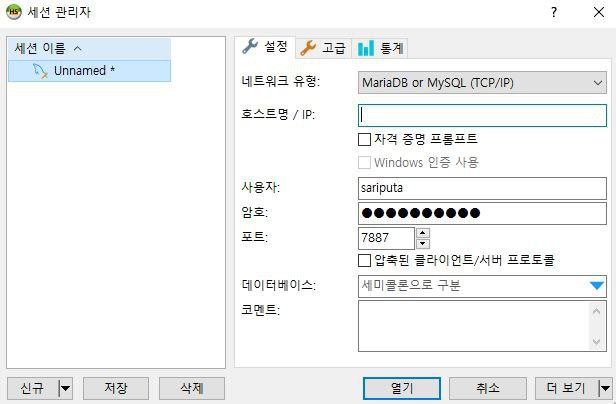
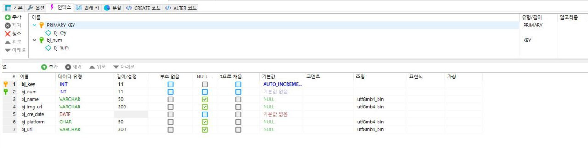
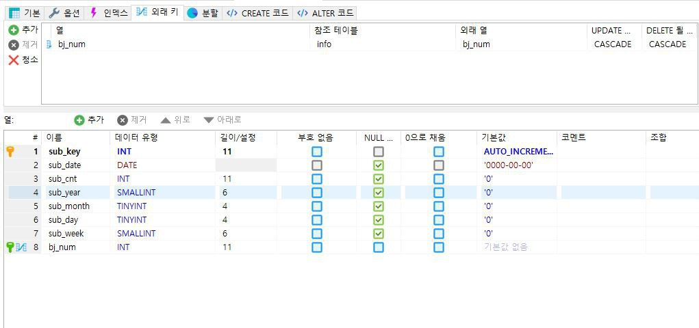
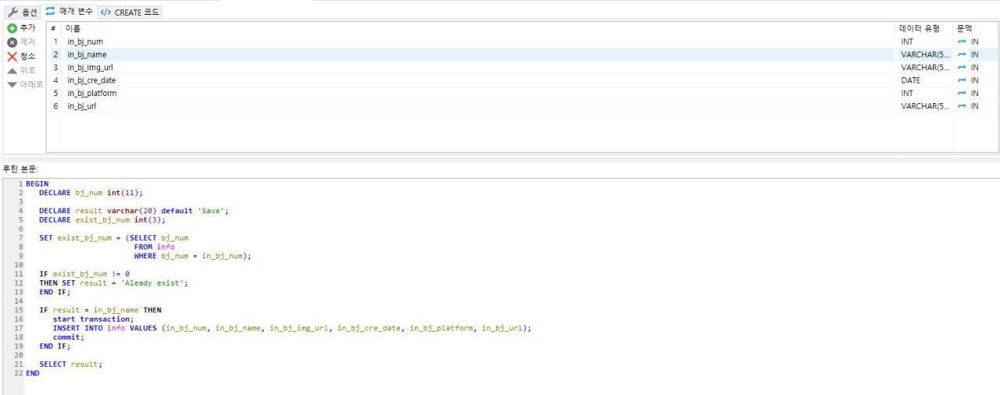
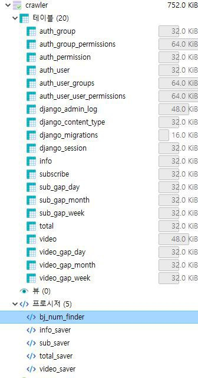

## HeidiSQL 사용

- HeidiSQL을 사용하여 테이블 및 프로시저를 만들었다.
- 다 좋은데 단점은 윈도우에서만 사용가능하다는 것 이었다.

###  Table 만들기

- HeidiSQL을 실행시키고 IP에 RDS의 엔드포인트를 적고 사용자에 관리자명, 암호, 포트를 입력한 뒤 접속 한다. 

- 테이블을 생성하여 컬럼과 프라이머리키 외래키 설정을 위한 키 설정 등을 한다.

- 외래키 설정은 외래키로 설정할 열과 참조테이블과 외래 열을 선택한뒤 저장한다.

- 프로시저는 매개변수와 로직을 따로 설정 해준다.

- 완성된 테이블과 프로시저 (auth와 django로 시작되는 테이블은 django에서 자동 생성 된것이다. 이것은 다음장에서 따로 살펴 보겠다.)

